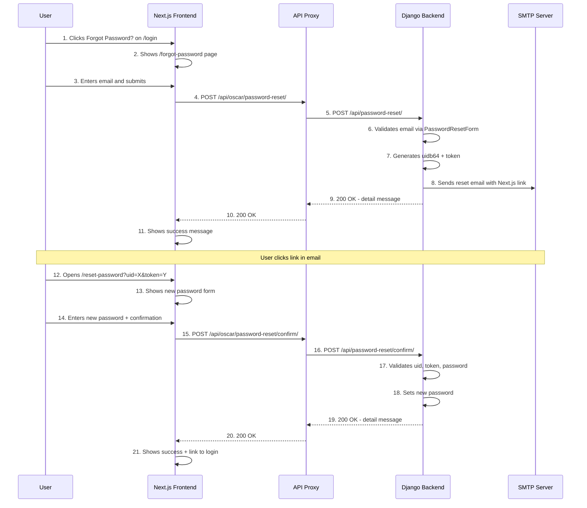
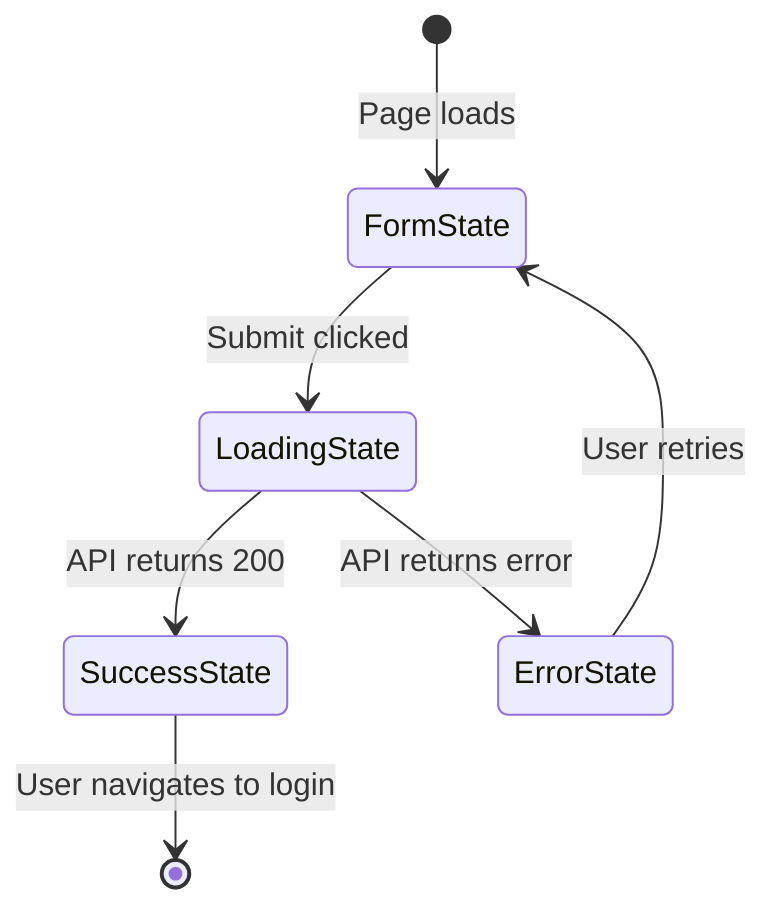
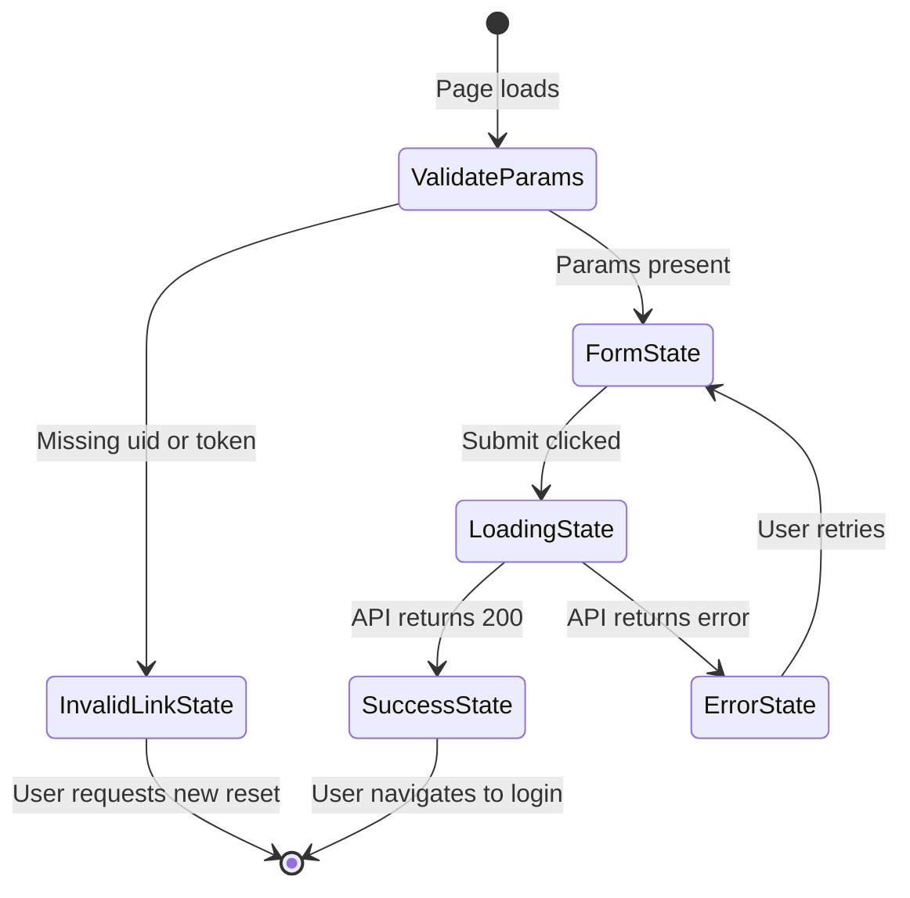

# Password Reset Architecture — Design Document

## Overview

This document describes the complete password reset flow between the **Next.js frontend** (church-bookstore) and the **Django backend** (oscar-3.1). The design introduces two new API endpoints on the Django side and two new pages on the Next.js side, following existing code patterns in both projects.

---

## Architecture Flow



---

## 1. Django Backend — API Endpoints

### 1.1 `POST /api/password-reset/`

**Purpose:** Accept an email address, validate it, generate a reset token, and send a reset email.

| Property | Value |
|---|---|
| URL | `/api/password-reset/` |
| Method | `POST` |
| Auth | None required — `permission_classes = []` |
| Content-Type | `application/json` |

#### Request Body

```json
{
  "email": "user@example.com"
}
```

#### Response — Success (200)

```json
{
  "detail": "Password reset email has been sent."
}
```

> **Security note:** The same success response is returned whether the email exists or not. This prevents email enumeration attacks. The email is only sent if the account actually exists.

#### Response — Bad Request (400)

```json
{
  "error": "Email is required."
}
```

```json
{
  "error": "Enter a valid email address."
}
```

#### Implementation Details

- Uses Django's built-in [`PasswordResetForm`](https://github.com/django/django/blob/main/django/contrib/auth/forms.py) for email validation and token generation
- Uses `default_token_generator` to generate the one-time-use token
- The email template must construct a link pointing to the **Next.js frontend**, not Django templates
- A new Django setting `PASSWORD_RESET_FRONTEND_URL` will hold the base URL of the Next.js frontend (e.g. `https://churchbookstore.com`)
- The reset link format: `{PASSWORD_RESET_FRONTEND_URL}/reset-password?uid={uidb64}&token={token}`
- Leverages Django's `PasswordResetForm.save()` method which handles multi-user matching and token generation internally

#### View Class

```python
class PasswordResetView(APIView):
    """API view for requesting a password reset email.
    
    POST: Accepts email, validates via PasswordResetForm,
    sends reset email with link to Next.js frontend.
    """
    permission_classes = []

    def post(self, request, *args, **kwargs):
        email = request.data.get('email')
        
        if not email:
            return Response(
                {'error': 'Email is required.'},
                status=status.HTTP_400_BAD_REQUEST
            )
        
        form = PasswordResetForm({'email': email})
        if not form.is_valid():
            return Response(
                {'error': 'Enter a valid email address.'},
                status=status.HTTP_400_BAD_REQUEST
            )
        
        # Build the reset link pointing to Next.js frontend
        frontend_url = getattr(
            settings, 'PASSWORD_RESET_FRONTEND_URL',
            'https://churchbookstore.com'
        )
        
        form.save(
            subject_template_name='registration/password_reset_subject.txt',
            email_template_name='registration/password_reset_email.html',
            use_https=True,
            from_email=settings.DEFAULT_FROM_EMAIL,
            request=request,
            extra_context={
                'frontend_url': frontend_url,
            },
        )
        
        # Always return success to prevent email enumeration
        return Response(
            {'detail': 'Password reset email has been sent.'}
        )
```

---

### 1.2 `POST /api/password-reset/confirm/`

**Purpose:** Validate the uid/token from the email link and set the new password.

| Property | Value |
|---|---|
| URL | `/api/password-reset/confirm/` |
| Method | `POST` |
| Auth | None required — `permission_classes = []` |
| Content-Type | `application/json` |

#### Request Body

```json
{
  "uid": "MQ",
  "token": "b5e4k3-2a1b...",
  "new_password1": "NewSecurePass123",
  "new_password2": "NewSecurePass123"
}
```

| Field | Type | Required | Description |
|---|---|---|---|
| `uid` | string | Yes | Base64-encoded user ID from email link |
| `token` | string | Yes | One-time reset token from email link |
| `new_password1` | string | Yes | New password |
| `new_password2` | string | Yes | New password confirmation |

#### Response — Success (200)

```json
{
  "detail": "Password has been reset successfully."
}
```

#### Response — Bad Request (400)

```json
{
  "error": "All fields are required."
}
```

```json
{
  "error": "Passwords do not match."
}
```

```json
{
  "error": "Password is too weak."
}
```

#### Response — Invalid/Expired Token (400)

```json
{
  "error": "Invalid or expired reset link."
}
```

#### Implementation Details

- Decodes `uid` using `force_text(urlsafe_base64_decode(uid))` to get the user
- Validates the token using `default_token_generator.check_token(user, token)`
- If the token is invalid or expired, returns an error — the user must request a new reset
- Validates the new password using Django's `validate_password()` with all configured validators
- Checks that `new_password1` matches `new_password2`
- Calls `user.set_password(new_password1)` and `user.save()` on success
- The token is single-use: after `set_password()` is called, the token is automatically invalidated because the user's `last_login` or password hash changes

#### View Class

```python
class PasswordResetConfirmView(APIView):
    """API view for confirming a password reset.
    
    POST: Accepts uid, token, new_password1, new_password2.
    Validates the token and sets the new password.
    """
    permission_classes = []

    def post(self, request, *args, **kwargs):
        uid = request.data.get('uid')
        token = request.data.get('token')
        new_password1 = request.data.get('new_password1')
        new_password2 = request.data.get('new_password2')
        
        # Validate required fields
        if not all([uid, token, new_password1, new_password2]):
            return Response(
                {'error': 'All fields are required.'},
                status=status.HTTP_400_BAD_REQUEST
            )
        
        # Decode the uidb64 to get the user
        try:
            from django.utils.encoding import force_text
            from django.utils.http import urlsafe_base64_decode
            uid_val = force_text(urlsafe_base64_decode(uid))
            user = User.objects.get(pk=uid_val)
        except (TypeError, ValueError, OverflowError, User.DoesNotExist):
            return Response(
                {'error': 'Invalid or expired reset link.'},
                status=status.HTTP_400_BAD_REQUEST
            )
        
        # Validate the token
        from django.contrib.auth.tokens import default_token_generator
        if not default_token_generator.check_token(user, token):
            return Response(
                {'error': 'Invalid or expired reset link.'},
                status=status.HTTP_400_BAD_REQUEST
            )
        
        # Validate passwords match
        if new_password1 != new_password2:
            return Response(
                {'error': 'Passwords do not match.'},
                status=status.HTTP_400_BAD_REQUEST
            )
        
        # Validate password strength using Django validators
        from django.contrib.auth.password_validation import validate_password
        try:
            validate_password(new_password1, user=user)
        except ValidationError as e:
            return Response(
                {'error': ' '.join(e.messages)},
                status=status.HTTP_400_BAD_REQUEST
            )
        
        # Set the new password
        user.set_password(new_password1)
        user.save()
        
        return Response(
            {'detail': 'Password has been reset successfully.'}
        )
```

---

## 2. Django Backend — Email Template

### 2.1 Email Subject Template

**File:** `templates/registration/password_reset_subject.txt`

```
Password Reset - {{ site_name }}
```

### 2.2 Email Body Template

**File:** `templates/registration/password_reset_email.html`

This template extends the existing email base template at [`templates/oscar/communication/emails/base.html`](../oscar-3.1/templates/oscar/communication/emails/base.html) for consistent branding.

```html



Password Reset


<h2></h2>
<p>
  You requested a password reset for your account at {{ site_name }}.
</p>
<p>
  
</p>
<table width="100%" cellpadding="0" cellspacing="0">
  <tr>
    <td align="center" style="padding: 20px 0;">
      <a href="{{ frontend_url }}/reset-password?uid={{ uid }}&token={{ token }}"
         style="background-color: #3182CE; color: #FFFFFF; padding: 12px 24px;
                text-decoration: none; border-radius: 6px; font-family: Arial, sans-serif;
                font-size: 16px; display: inline-block;">
        
      </a>
    </td>
  </tr>
</table>
<p>
  
</p>
<p style="word-break: break-all;">
  {{ frontend_url }}/reset-password?uid={{ uid }}&token={{ token }}
</p>
<p style="color: #718096; font-size: 13px;">
  
</p>

```

> **Note:** Django's `PasswordResetForm.save()` passes `uid` and `token` as context variables to the email template automatically. The `frontend_url` is passed via `extra_context`.

### 2.3 Plain Text Fallback

**File:** `templates/registration/password_reset_email.txt`

```

 {{ site_name }}.



{{ frontend_url }}/reset-password?uid={{ uid }}&token={{ token }}



```

---

## 3. Django Backend — URL Registration

Following the existing pattern in [`apps/api/apps.py`](../oscar-3.1/apps/api/apps.py), the new views are registered as:

### Changes to `apps/api/apps.py`

```python
# In ready():
self.password_reset_view = get_class('api.views', 'PasswordResetView')
self.password_reset_confirm_view = get_class('api.views', 'PasswordResetConfirmView')

# In get_urls():
re_path(r'^password-reset/?$', self.password_reset_view.as_view(), name='password-reset'),
re_path(r'^password-reset/confirm/?$', self.password_reset_confirm_view.as_view(), name='password-reset-confirm'),
```

### Changes to `project/settings.py`

Add a new setting:

```python
# Base URL of the Next.js frontend for password reset links
PASSWORD_RESET_FRONTEND_URL = env('PASSWORD_RESET_FRONTEND_URL', default='https://churchbookstore.com')
```

---

## 4. Next.js Frontend — Pages

### 4.1 Forgot Password Page: `app/forgot-password/page.tsx`

**Route:** `/forgot-password`  
**Linked from:** [`app/login/page.tsx`](app/login/page.tsx:120) — the existing `<Link href="/forgot-password">` on line 120

#### Page States



#### Component Structure

```
ForgotPasswordPage
├── Page header (title + description)
├── Form card
│   ├── Error alert (conditional)
│   ├── Email input with Mail icon
│   └── Submit button
└── Back to login link
```

#### Wireframe

```
┌─────────────────────────────────────────┐
│                                         │
│          Reset Your Password            │
│  Enter your email and we will send you  │
│        a reset link.                    │
│                                         │
│  ┌───────────────────────────────────┐  │
│  │                                   │  │
│  │  [error alert - conditional]      │  │
│  │                                   │  │
│  │  Email Address                    │  │
│  │  ┌─────────────────────────────┐ │  │
│  │  │ ✉ you@example.com           │ │  │
│  │  └─────────────────────────────┘ │  │
│  │                                   │  │
│  │  [    Send Reset Link     ]      │  │
│  │                                   │  │
│  └───────────────────────────────────┘  │
│                                         │
│  Remember your password? Sign In        │
│                                         │
└─────────────────────────────────────────┘
```

#### Success State Wireframe

```
┌─────────────────────────────────────────┐
│                                         │
│          Check Your Email               │
│  If an account exists for that email,   │
│  we have sent a password reset link.    │
│                                         │
│  ┌───────────────────────────────────┐  │
│  │                                   │  │
│  │  ✉  Check your inbox and spam    │  │
│  │     folder for the reset link.   │  │
│  │                                   │  │
│  │  [    Back to Sign In     ]      │  │
│  │                                   │  │
│  └───────────────────────────────────┘  │
│                                         │
└─────────────────────────────────────────┘
```

#### Key Implementation Details

- Follows the same layout pattern as [`app/login/page.tsx`](app/login/page.tsx): `min-h-screen bg-background`, `max-w-md w-full mx-auto`, white card with `rounded-2xl shadow-sm p-8`
- Uses `useTranslations('auth.forgotPassword')` for i18n
- Makes a direct `fetch` to `/api/oscar/password-reset/` (proxied to Django)
- Always shows the success message regardless of whether the email exists (prevents enumeration)
- No `AuthContext` integration needed — this is an unauthenticated flow
- Uses `Mail` icon from `lucide-react` (consistent with login page)
- Loading state disables the form and shows "Sending..." on the button

#### API Call

```typescript
const handleSubmit = async (e: React.FormEvent) => {
  e.preventDefault();
  setIsSubmitting(true);
  setError(null);

  try {
    const response = await fetch('/api/oscar/password-reset/', {
      method: 'POST',
      headers: { 'Content-Type': 'application/json' },
      body: JSON.stringify({ email: formData.email }),
    });

    const data = await response.json();

    if (!response.ok) {
      setError(data.error || t('failed'));
      return;
    }

    setSuccess(true);
  } catch {
    setError(t('failed'));
  } finally {
    setIsSubmitting(false);
  }
};
```

---

### 4.2 Reset Password Page: `app/reset-password/page.tsx`

**Route:** `/reset-password?uid=<uidb64>&token=<token>`  
**Reached from:** The link in the reset email

#### Page States



#### Component Structure

```
ResetPasswordPage
├── Page header (title + description)
├── Invalid link state (conditional)
│   ├── Error message
│   └── Link to /forgot-password
├── Form card
│   ├── Error alert (conditional)
│   ├── New password input with Lock icon + show/hide toggle
│   ├── Password strength indicator
│   ├── Confirm password input with Lock icon + show/hide toggle
│   └── Submit button
└── Success state
    ├── Success message
    └── Link to /login
```

#### Wireframe — Form State

```
┌─────────────────────────────────────────┐
│                                         │
│          Set New Password               │
│  Enter your new password below.         │
│                                         │
│  ┌───────────────────────────────────┐  │
│  │                                   │  │
│  │  [error alert - conditional]      │  │
│  │                                   │  │
│  │  New Password                    │  │
│  │  ┌─────────────────────────────┐ │  │
│  │  │ 🔒 ••••••••          [👁]  │ │  │
│  │  └─────────────────────────────┘ │  │
│  │  Password Strength: ████ Strong  │  │
│  │                                   │  │
│  │  Confirm New Password            │  │
│  │  ┌─────────────────────────────┐ │  │
│  │  │ 🔒 ••••••••          [👁]  │ │  │
│  │  └─────────────────────────────┘ │  │
│  │                                   │  │
│  │  [    Reset Password      ]      │  │
│  │                                   │  │
│  └───────────────────────────────────┘  │
│                                         │
└─────────────────────────────────────────┘
```

#### Wireframe — Invalid Link State

```
┌─────────────────────────────────────────┐
│                                         │
│       Invalid Reset Link                 │
│  The password reset link is invalid or  │
│  has expired. Please request a new one. │
│                                         │
│  ┌───────────────────────────────────┐  │
│  │                                   │  │
│  │  ⚠ The link may have expired or  │  │
│  │    already been used.            │  │
│  │                                   │  │
│  │  [ Request New Reset Link ]      │  │
│  │                                   │  │
│  └───────────────────────────────────┘  │
│                                         │
└─────────────────────────────────────────┘
```

#### Wireframe — Success State

```
┌─────────────────────────────────────────┐
│                                         │
│       Password Reset Successfully        │
│  Your password has been reset. You can  │
│  now sign in with your new password.    │
│                                         │
│  ┌───────────────────────────────────┐  │
│  │                                   │  │
│  │  ✓ Your password was changed      │  │
│  │    successfully.                   │  │
│  │                                   │  │
│  │  [    Sign In             ]      │  │
│  │                                   │  │
│  └───────────────────────────────────┘  │
│                                         │
└─────────────────────────────────────────┘
```

#### Key Implementation Details

- Uses `useSearchParams()` from `next/navigation` to read `uid` and `token` from the URL
- If either `uid` or `token` is missing, shows the "invalid link" state immediately
- Reuses the `getPasswordStrength()` function from [`app/register/page.tsx`](app/register/page.tsx:11) — this should be extracted to a shared utility
- Password strength indicator follows the same visual pattern as the register page
- Show/hide password toggle follows the same pattern as [`app/login/page.tsx`](app/login/page.tsx:93)
- The `uid` and `token` are sent as-is to the API — no client-side decoding needed
- On success, shows a link to `/login` (not auto-redirect, to let the user read the confirmation)
- Uses `useTranslations('auth.resetPassword')` for i18n

#### API Call

```typescript
const handleSubmit = async (e: React.FormEvent) => {
  e.preventDefault();
  setIsSubmitting(true);
  setError(null);

  // Client-side validation
  if (formData.newPassword !== formData.confirmPassword) {
    setError(t('passwordMismatch'));
    setIsSubmitting(false);
    return;
  }

  if (!isPasswordStrongEnough) {
    setError(t('passwordTooWeak'));
    setIsSubmitting(false);
    return;
  }

  try {
    const response = await fetch('/api/oscar/password-reset/confirm/', {
      method: 'POST',
      headers: { 'Content-Type': 'application/json' },
      body: JSON.stringify({
        uid: searchParams.get('uid'),
        token: searchParams.get('token'),
        new_password1: formData.newPassword,
        new_password2: formData.confirmPassword,
      }),
    });

    const data = await response.json();

    if (!response.ok) {
      setError(data.error || t('failed'));
      return;
    }

    setSuccess(true);
  } catch {
    setError(t('failed'));
  } finally {
    setIsSubmitting(false);
  }
};
```

---

## 5. i18n — Translation Keys

### New keys to add under `auth` in all 4 locale files

The existing `auth` section in [`app/i18n/locales/en.json`](app/i18n/locales/en.json:242) already contains `login` and `register` sub-objects. Two new sub-objects will be added: `forgotPassword` and `resetPassword`.

#### `auth.forgotPassword`

```json
{
  "auth": {
    "forgotPassword": {
      "title": "Reset Your Password",
      "description": "Enter your email address and we will send you a link to reset your password.",
      "email": "Email Address",
      "emailPlaceholder": "you@example.com",
      "submit": "Send Reset Link",
      "sending": "Sending...",
      "successTitle": "Check Your Email",
      "successDescription": "If an account exists for that email, we have sent a password reset link. Please check your inbox and spam folder.",
      "backToLogin": "Back to Sign In",
      "failed": "Failed to send reset email. Please try again."
    }
  }
}
```

#### `auth.resetPassword`

```json
{
  "auth": {
    "resetPassword": {
      "title": "Set New Password",
      "description": "Enter your new password below.",
      "newPassword": "New Password",
      "confirmPassword": "Confirm New Password",
      "newPasswordPlaceholder": "Enter new password",
      "confirmPasswordPlaceholder": "Confirm new password",
      "submit": "Reset Password",
      "resetting": "Resetting...",
      "successTitle": "Password Reset Successfully",
      "successDescription": "Your password has been reset. You can now sign in with your new password.",
      "signIn": "Sign In",
      "invalidLinkTitle": "Invalid Reset Link",
      "invalidLinkDescription": "The password reset link is invalid or has expired. Please request a new one.",
      "requestNewLink": "Request New Reset Link",
      "passwordMismatch": "Passwords do not match",
      "passwordTooWeak": "Password is too weak",
      "passwordStrength": "Password Strength",
      "passwordWeak": "Weak",
      "passwordMedium": "Medium",
      "passwordStrong": "Strong",
      "passwordMinLength": "At least 8 characters",
      "passwordHasLetter": "Contains letters",
      "passwordHasDigit": "Contains digits",
      "passwordHasUppercase": "Contains uppercase and lowercase",
      "failed": "Failed to reset password. The link may have expired."
    }
  }
}
```

These keys must be added to all 4 locale files:
- [`app/i18n/locales/en.json`](app/i18n/locales/en.json)
- [`app/i18n/locales/ru.json`](app/i18n/locales/ru.json)
- [`app/i18n/locales/zh-hans.json`](app/i18n/locales/zh-hans.json)
- [`app/i18n/locales/zh-hant.json`](app/i18n/locales/zh-hant.json)

---

## 6. Security Considerations

| Concern | Mitigation |
|---|---|
| **Email enumeration** | The `/api/password-reset/` endpoint always returns 200, regardless of whether the email exists. The email is only sent if the account exists, but the response is identical. |
| **Token expiration** | Django's `default_token_generator` tokens expire when the user's password changes or `last_login` updates. By default, tokens are valid for `PASSWORD_RESET_TIMEOUT` days (default: 3 days in Django 3.2+). |
| **Token single-use** | After `user.set_password()` is called, the token is automatically invalidated because the password hash changes. A second use of the same token will fail. |
| **Password validation** | Django's full `validate_password()` is called, enforcing all configured validators (minimum length, common passwords, etc.). |
| **CSRF** | Not applicable — these are API endpoints consumed by a separate SPA frontend, not Django template forms. The DRF `APIView` does not enforce CSRF for JSON requests. |
| **Rate limiting** | The `/api/password-reset/` endpoint should be rate-limited to prevent abuse. This can be done via Django's `django-ratelimit` or at the reverse proxy level (nginx). Recommended: 5 requests per email per hour, 20 requests per IP per hour. |
| **HTTPS** | The email link uses HTTPS (`use_https=True` in `form.save()`). The Next.js frontend should enforce HTTPS in production. |
| **Token in URL** | The token is passed as a URL query parameter. This is standard for password reset flows. The Next.js page should not log or store the token beyond the immediate API call. |
| **uid exposure** | The `uid` is a base64-encoded primary key. This is standard Django behavior and not considered a security risk since the token is the actual secret. |

---

## 7. Error Handling

### Backend Error Responses

Both endpoints return errors in a consistent format:

```json
{
  "error": "Human-readable error message in English"
}
```

The error messages are intentionally generic to avoid information leakage. Specific error scenarios:

| Scenario | HTTP Status | Error Message |
|---|---|---|
| Missing required field | 400 | `"Email is required."` / `"All fields are required."` |
| Invalid email format | 400 | `"Enter a valid email address."` |
| Passwords don't match | 400 | `"Passwords do not match."` |
| Password too weak | 400 | `"Password is too weak."` (or specific validator message) |
| Invalid/expired token | 400 | `"Invalid or expired reset link."` |
| Invalid uid | 400 | `"Invalid or expired reset link."` |

### Frontend Error Handling

- **Network errors:** Show generic "Failed to send reset email" / "Failed to reset password" message
- **API errors:** Display the `error` field from the response
- **Client-side validation:** Password mismatch and strength checks happen before the API call
- **Missing URL params:** The reset password page validates `uid` and `token` are present on mount; if missing, shows the "invalid link" state without making an API call

---

## 8. File-by-File Implementation Plan

### Django Backend (oscar-3.1)

| # | File | Action | Description |
|---|---|---|---|
| 1 | `apps/api/views.py` | **Modify** | Add `PasswordResetView` and `PasswordResetConfirmView` classes after the existing `ChangePasswordView` |
| 2 | `apps/api/apps.py` | **Modify** | Add `self.password_reset_view` and `self.password_reset_confirm_view` in `ready()`; add two `re_path` entries in `get_urls()` |
| 3 | `project/settings.py` | **Modify** | Add `PASSWORD_RESET_FRONTEND_URL` setting |
| 4 | `templates/registration/password_reset_subject.txt` | **Create** | Email subject template |
| 5 | `templates/registration/password_reset_email.html` | **Create** | HTML email body template extending the existing base email template |
| 6 | `templates/registration/password_reset_email.txt` | **Create** | Plain text email body fallback |

### Next.js Frontend (church-bookstore)

| # | File | Action | Description |
|---|---|---|---|
| 7 | `app/forgot-password/page.tsx` | **Create** | Forgot password page with email form and success state |
| 8 | `app/reset-password/page.tsx` | **Create** | Reset password page with new password form, invalid link state, and success state |
| 9 | `app/lib/password.ts` | **Create** | Shared password strength utility extracted from register page |
| 10 | `app/i18n/locales/en.json` | **Modify** | Add `auth.forgotPassword` and `auth.resetPassword` translation keys |
| 11 | `app/i18n/locales/ru.json` | **Modify** | Add Russian translations for the same keys |
| 12 | `app/i18n/locales/zh-hans.json` | **Modify** | Add Simplified Chinese translations for the same keys |
| 13 | `app/i18n/locales/zh-hant.json` | **Modify** | Add Traditional Chinese translations for the same keys |

### Optional Refactor

| # | File | Action | Description |
|---|---|---|---|
| 14 | `app/register/page.tsx` | **Modify** | Replace inline `getPasswordStrength()` with import from `app/lib/password.ts` |

---

## 9. API Proxy Considerations

The existing API proxy at [`app/api/oscar/[...path]/route.ts`](app/api/oscar/[...path]/route.ts) already handles all the requirements for the new endpoints:

- **Trailing slashes:** The proxy appends trailing slashes (line 24), so `/api/oscar/password-reset/` → Django `/api/password-reset/` ✓
- **JSON body forwarding:** POST body is forwarded for all non-GET methods (lines 65-72) ✓
- **No auth header needed:** Both endpoints are public (`permission_classes = []`), so no `Authorization` header is required ✓
- **Response forwarding:** JSON responses are forwarded as-is (lines 100+) ✓

**No changes needed to the proxy.**

---

## 10. Testing Plan

### Backend Tests

| Test | Description |
|---|---|
| `test_password_reset_valid_email` | POST with valid email → 200, email is sent |
| `test_password_reset_invalid_email` | POST with non-existent email → 200 (same response, no email sent) |
| `test_password_reset_missing_email` | POST without email → 400 |
| `test_password_reset_invalid_format` | POST with invalid email format → 400 |
| `test_password_reset_confirm_valid` | POST with valid uid/token/password → 200, password is changed |
| `test_password_reset_confirm_invalid_token` | POST with wrong token → 400 |
| `test_password_reset_confirm_expired_token` | POST after token used → 400 |
| `test_password_reset_confirm_invalid_uid` | POST with bad uid → 400 |
| `test_password_reset_confirm_password_mismatch` | POST with mismatched passwords → 400 |
| `test_password_reset_confirm_weak_password` | POST with weak password → 400 |
| `test_password_reset_link_points_to_frontend` | Email contains the Next.js frontend URL, not Django URL |

### Frontend Tests

| Test | Description |
|---|---|
| Forgot password form renders correctly | |
| Shows validation error for empty email | |
| Shows success message after submission | |
| Displays API error on failure | |
| Reset password form renders with valid URL params | |
| Shows invalid link state when uid/token missing | |
| Shows password strength indicator | |
| Shows mismatch error for different passwords | |
| Shows success message after successful reset | |
| Displays API error on invalid/expired token | |
