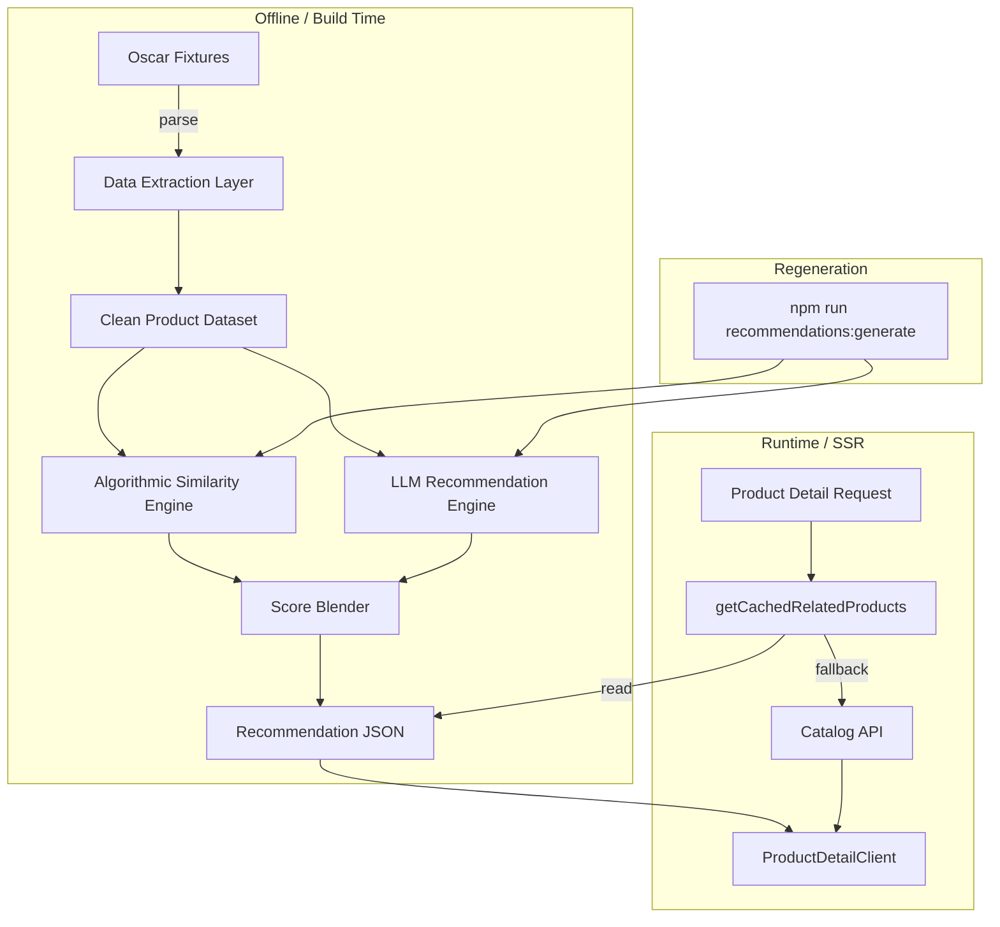
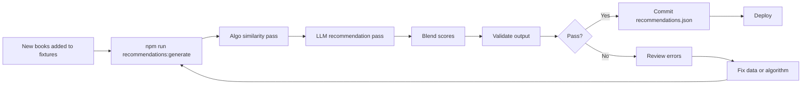
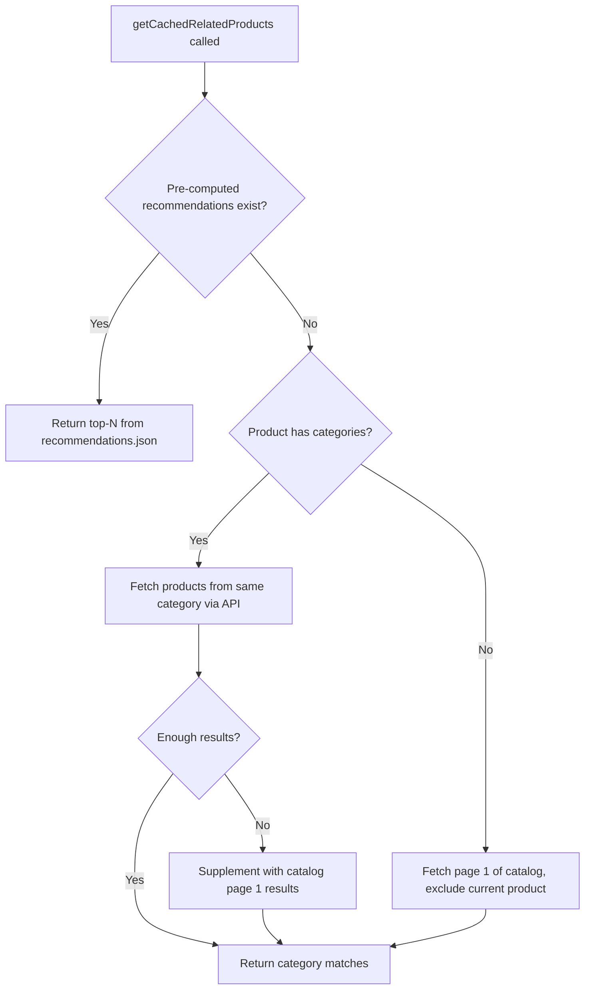

# Recommendation System Plan — Church Bookstore

## 1. Executive Summary

The church-bookstore product detail page currently shows the same 4 hard-coded books for every product — it simply takes the first 4 products from page 1 of the catalog, excluding the current product. This plan describes a **pre-computed, hybrid recommendation system** that combines algorithmic similarity with LLM-generated recommendations, producing personalised "You may also like" suggestions offline and serving them at runtime from a static JSON file.

### Why pre-computed?

| Factor | Detail |
|--------|--------|
| Catalog size | 274 products — small enough to compute an all-pairs similarity matrix in seconds |
| No user data | No ratings, reviews, or purchase history exist, ruling out collaborative filtering |
| Runtime cost | Zero — recommendations are read from a JSON file during SSR |
| Quality | With only 274 books, LLM-based generation is both feasible and mandatory — the LLM understands theological nuance that algorithms miss |

### Approach at a glance

1. **Extract** English metadata from Django Oscar fixtures.
2. **Score** every product pair using a hybrid formula: category overlap + author match + text similarity (TF-IDF cosine).
3. **Enhance** with LLM: for each product, ask an LLM (via nano-gpt API) to select the most thematically related books from the catalog.
4. **Blend** algorithmic and LLM scores into a final composite ranking, then write to a JSON file.
5. **Serve** recommendations at runtime by reading the JSON file in [`getCachedRelatedProducts()`](app/lib/server-cache.ts:40).
6. **Regenerate** on demand via a Node.js CLI script when new books are added.

---

## 2. Architecture Overview



### Data flow

1. **Build time / CLI**: The `recommendations.json` file is generated from fixture data in two passes — first the algorithmic similarity engine, then the LLM recommendation engine — and their outputs are blended into a single ranking per product. The file is committed to the repository (or generated in CI).
2. **SSR**: [`getCachedRelatedProducts()`](app/lib/server-cache.ts:40) reads the pre-computed file, looks up the product ID, and returns up to N product IDs. It then fetches the full [`Book`](app/types/index.ts:12) objects for those IDs via the existing Oscar API.
3. **Fallback**: If a product ID is not found in the recommendations file (e.g., a newly added book), the function falls back to category-based fetching from the live API.

---

## 3. Recommendation Algorithm Design

### 3.1 Signals and Weights

The hybrid similarity score between two products *A* and *B* is:

```
similarity(A, B) = 0.45 × S_cat(A, B)
                 + 0.25 × S_text(A, B)
                 + 0.15 × S_author(A, B)
                 + 0.10 × S_pub(A, B)
                 + 0.05 × S_lang(A, B)
```

| Signal | Weight | Rationale |
|--------|--------|-----------|
| **Category overlap** `S_cat` | 0.45 | Strongest signal — books in the same category are topically related. Uses Jaccard similarity over category ID sets. |
| **Text similarity** `S_text` | 0.25 | TF-IDF cosine similarity over cleaned English descriptions. Captures topical overlap beyond categories. |
| **Author match** `S_author` | 0.15 | Exact normalised match on `author_en`. Binary 1/0. Readers often want more from the same author. |
| **Publisher match** `S_pub` | 0.10 | Exact normalised match on `publisher`. Same publisher often implies similar theological tradition. |
| **Language match** `S_lang` | 0.05 | Overlap in `text_script` field. Books in the same language appeal to the same reader. |

### 3.2 Category Overlap — `S_cat`

```text
S_cat(A, B) = |categories(A) ∩ categories(B)| / |categories(A) ∪ categories(B)|
```

- Source: `productcategory.json` maps `product` → `category` (many-to-many).
- Categories are treated as a flat set of IDs (no hierarchy weighting in v1).
- Products with no category overlap score 0 on this signal.

### 3.3 Text Similarity — `S_text`

1. **Strip HTML** from `description_en` using a simple tag remover.
2. **Normalise**: lowercase, remove punctuation, collapse whitespace.
3. **Tokenise** on whitespace.
4. **Compute TF-IDF** vectors across the full corpus of 274 descriptions.
5. **Cosine similarity** between each pair of TF-IDF vectors.

Implementation: use the `natural` npm package (pure JS, no native deps) or a lightweight TF-IDF implementation. With only 274 documents, performance is not a concern.

### 3.4 Author Match — `S_author`

```text
S_author(A, B) = 1  if normalise(author_en_A) === normalise(author_en_B)
                 0  otherwise
```

Normalisation: trim, lowercase, collapse internal whitespace. Null/empty author fields → 0.

### 3.5 Publisher Match — `S_pub`

Same binary logic as author match, applied to the `publisher` field.

### 3.6 Language Match — `S_lang`

```text
S_lang(A, B) = |languages(A) ∩ languages(B)| / |languages(A) ∪ languages(B)|
```

The `text_script` field contains values like `"Traditional Chinese / Русский"`. Split on `"/"`, trim each part, and compute Jaccard similarity.

### 3.7 Algorithmic Composite Scoring and Selection

For each product P:

1. Compute `similarity(P, Q)` for every other product Q.
2. Sort descending by similarity score.
3. Take the top **20** candidates (a wider pool for the blender to work with).
4. Store as `algoRecommendations[P.id] = [{ id, score }, ...]`.

### 3.8 LLM-Generated Recommendations (Mandatory)

With only 274 products, an LLM can produce superior recommendations by understanding theological nuance, thematic connections, and reader intent that pure algorithms miss. This is a **mandatory** part of the pipeline, not optional.

#### Approach: Batch prompt per product (~274 API calls)

For each product, send its metadata + a summary of the full catalog to the LLM via the nano-gpt API:

- **Input per call**: The product's full English metadata (title, author, description, categories) + a numbered list of all other products (id, title, author, categories).
- **Prompt**: Ask the LLM to act as an Orthodox Christianity book expert and select the 8 most thematically related books (a wider pool for blending), returning a ranked list with relevance scores.
- **Output**: A ranked list of `{ id, relevanceScore, reason }` for each product. The final output after blending is 4 recommendations per product.
- **Cost estimate**: ~274 × 2K tokens ≈ 550K input tokens with GPT-4o-mini (~$0.30 total).
- **Rate limiting**: Configurable concurrency (default: 5 concurrent requests) to respect API quotas.

#### LLM prompt design

```
System: You are an expert in Orthodox Christian literature. Given a source book
and a catalog of available titles, select the most thematically and spiritually
related books. Consider theological themes, liturgical context, author tradition,
and reader interest patterns. Return a JSON array of {id, score, reason} where
score is 1-10.

User: Source book: "{title}" by {author}. Categories: {categories}.
Description: {description_truncated}

Catalog:
1. [ID:{id}] "{title}" by {author} — Categories: {cats}
2. [ID:{id}] "{title}" by {author} — Categories: {cats}
...

Select the 8 most related books from the catalog. Respond with JSON only. (We blend these with algorithmic results and keep the top 4.)
```

### 3.9 Blending Algorithmic and LLM Scores

The final recommendation ranking for each product is a weighted blend of both signals:

```text
blendedScore(Q) = W_algo × normalise(algoScore(Q)) + W_llm × normalise(llmScore(Q))
```

**Default weights:**

| Source | Weight | Rationale |
|--------|--------|-----------|
| Algorithmic | 0.4 | Provides consistent, structured similarity based on metadata |
| LLM | 0.6 | Captures theological nuance and thematic depth that metadata alone misses |

**Normalisation**: Both scores are normalised to [0, 1] within each product's candidate set before blending.

**Blending algorithm** (per product P):

1. Take the algorithmic top-20 candidates with their scores.
2. Take the LLM top-8 candidates with their scores.
3. Build a union set of all candidate product IDs.
4. For candidates only in one source, assign 0 for the missing source.
5. Normalise each score column to [0, 1].
6. Compute `blendedScore = 0.4 × algoNorm + 0.6 × llmNorm`.
7. Sort by blended score descending.
8. Take the top **4** as the final recommendations (fitting a single row in the product detail view).

**Why 0.6 LLM weight**: The LLM understands that "The Ladder of Divine Ascent" and "The Philokalia" are spiritually related even if their metadata has little overlap. This theological intelligence outweighs pure metadata matching.

**Fallback within blending**: If the LLM API fails for a specific product (rate limit, timeout, parse error), the algorithmic scores are used with weight 1.0 for that product. A warning is logged.

---

## 4. Storage Design

### 4.1 File-based JSON storage

The recommendations are stored in a single JSON file:

```
app/data/recommendations.json
```

### 4.2 Schema

```typescript
// app/data/recommendations.json
interface RecommendationEntry {
  id: number;           // product PK
  score: number;        // blended score (0-1)
  algoScore: number;    // algorithmic composite score (0-1, normalised)
  llmScore: number;     // LLM relevance score (0-1, normalised), 0 if LLM failed
}

interface RecommendationsData {
  version: string;                  // semver, e.g. "1.0.0"
  generatedAt: string;              // ISO 8601 timestamp
  productCount: number;             // total products processed
  llmEnhanced: boolean;             // true if LLM pass completed successfully
  blendWeights: {                   // weights used for blending
    algo: number;
    llm: number;
  };
  recommendations: {
    [productId: string]: RecommendationEntry[];  // top-4 per product
  };
}
```

Example:

```json
{
  "version": "1.0.0",
  "generatedAt": "2026-05-22T12:00:00Z",
  "productCount": 274,
  "llmEnhanced": true,
  "blendWeights": { "algo": 0.4, "llm": 0.6 },
  "recommendations": {
    "1": [
      { "id": 42, "score": 0.91, "algoScore": 0.85, "llmScore": 0.95 },
      { "id": 15, "score": 0.82, "algoScore": 0.78, "llmScore": 0.85 },
      { "id": 7, "score": 0.79, "algoScore": 0.90, "llmScore": 0.70 }
    ]
  }
}
```

### 4.3 Why JSON file over database?

| Consideration | JSON File | Database Table |
|---------------|-----------|----------------|
| Deployment | Committed to git, deploys with code | Requires migration |
| Complexity | Zero — `fs.readFileSync` | ORM, connection, query |
| Size | ~50-100 KB for 274 × 8 entries | Negligible row count |
| Update frequency | Only when catalog changes | Same |
| Atomicity | File replace is atomic on POSIX | Transactional |

For a 274-product catalog, a JSON file is the simplest correct solution. If the catalog grows beyond ~5,000 products, consider migrating to a database table.

### 4.4 Runtime lookup module

A new module `app/lib/recommendations.ts` will encapsulate file reading:

```typescript
// app/lib/recommendations.ts
import { readFileSync } from 'fs';
import { join } from 'path';

let _data: RecommendationsData | null = null;

function loadRecommendations(): RecommendationsData {
  if (!_data) {
    const filePath = join(process.cwd(), 'app/data/recommendations.json');
    const raw = readFileSync(filePath, 'utf-8');
    _data = JSON.parse(raw);
  }
  return _data;
}

export function getRecommendedProductIds(
  productId: string,
  limit: number = 4
): number[] {
  const data = loadRecommendations();
  const entries = data.recommendations[productId];
  if (!entries || entries.length === 0) return [];
  return entries.slice(0, limit).map((e) => e.id);
}
```

---

## 5. Sprint Breakdown

### Sprint 1: Data Extraction & Preparation

**Goal**: Build a clean, typed dataset from Oscar fixtures that the similarity engine can consume.

#### Tasks

- [ ] Create `scripts/recommendations/` directory for all recommendation tooling
- [ ] Create `scripts/recommendations/types.ts` — TypeScript interfaces for the extracted product data:
  ```typescript
  interface ExtractedProduct {
    id: number;
    title: string;           // title_en
    description: string;     // description_en, HTML stripped
    author: string;          // author_en
    publisher: string;
    textScript: string;
    categoryIds: number[];
    requiresShipping: boolean;
  }
  ```
- [ ] Create `scripts/recommendations/extract.ts` — reads fixture files and produces `ExtractedProduct[]`:
  - Parse `/home/alexey/workspace/oscar-3.1/fixtures/product.json`
  - Parse `/home/alexey/workspace/oscar-3.1/fixtures/productcategory.json`
  - Parse `/home/alexey/workspace/oscar-3.1/fixtures/category.json`
  - Filter to `structure === "standalone"` and `is_public === true` only
  - Use only `_en` suffixed fields
  - Strip HTML from descriptions
  - Build a `Map<number, number[]>` for product → category IDs
  - Output to `scripts/recommendations/data/extracted-products.json`
- [ ] Create `scripts/recommendations/html-stripper.ts` — utility to remove HTML tags and decode entities
- [ ] Add `tsconfig.scripts.json` for the scripts directory (extends root tsconfig, targets Node.js)
- [ ] Verify: run extraction and confirm 274 products with populated fields

#### Files to create

| File | Purpose |
|------|---------|
| `scripts/recommendations/types.ts` | Shared TypeScript interfaces |
| `scripts/recommendations/extract.ts` | Fixture parsing and data extraction |
| `scripts/recommendations/html-stripper.ts` | HTML-to-plain-text utility |
| `scripts/recommendations/tsconfig.scripts.json` | TypeScript config for scripts |
| `scripts/recommendations/data/extracted-products.json` | Output artifact (gitignored) |

#### Acceptance criteria

- Running `npx tsx scripts/recommendations/extract.ts` produces a JSON file with ~274 products
- Each product has non-empty `title`, `description` (plain text), `author`, and at least one `categoryId`
- No HTML tags remain in description fields

---

### Sprint 2: Similarity Engine

**Goal**: Implement the five similarity signals and the composite scoring formula.

#### Tasks

- [ ] Create `scripts/recommendations/similarity/category.ts` — Jaccard similarity over category ID sets
- [ ] Create `scripts/recommendations/similarity/text.ts` — TF-IDF cosine similarity:
  - Build a custom TF-IDF implementation or use the `natural` npm package
  - Tokenise, lowercase, remove stop words
  - Compute document-term matrix for all 274 descriptions
  - Expose a `computeTextSimilarityMatrix(products)` function returning `Map<string, Map<string, number>>`
- [ ] Create `scripts/recommendations/similarity/author.ts` — normalised exact match
- [ ] Create `scripts/recommendations/similarity/publisher.ts` — normalised exact match
- [ ] Create `scripts/recommendations/similarity/language.ts` — Jaccard similarity on split `textScript`
- [ ] Create `scripts/recommendations/similarity/composite.ts` — weighted combination:
  ```typescript
  function computeCompositeScore(
    sCat: number, sText: number, sAuthor: number,
    sPub: number, sLang: number
  ): number {
    return 0.45 * sCat + 0.25 * sText + 0.15 * sAuthor
         + 0.10 * sPub  + 0.05 * sLang;
  }
  ```
- [ ] Create `scripts/recommendations/similarity/index.ts` — orchestrator that:
  - Loads extracted products
  - Computes all-pairs similarity (274 × 273 = 74,802 pairs — trivial)
  - For each product, sorts by composite score and selects top 20 (wide pool for blending)
  - Returns the full recommendation map
- [ ] Add unit tests in `scripts/recommendations/__tests__/similarity.test.ts`:
  - Test Jaccard with known sets
  - Test author match with normalisation
  - Test composite scoring formula
  - Test with a small fixture of 5 products

#### Files to create

| File | Purpose |
|------|---------|
| `scripts/recommendations/similarity/category.ts` | Category Jaccard similarity |
| `scripts/recommendations/similarity/text.ts` | TF-IDF text similarity |
| `scripts/recommendations/similarity/author.ts` | Author match |
| `scripts/recommendations/similarity/publisher.ts` | Publisher match |
| `scripts/recommendations/similarity/language.ts` | Language overlap |
| `scripts/recommendations/similarity/composite.ts` | Weighted composite score |
| `scripts/recommendations/similarity/index.ts` | Orchestrator |
| `scripts/recommendations/__tests__/similarity.test.ts` | Unit tests |

#### Acceptance criteria

- All similarity functions produce values in [0, 1]
- The composite scorer returns sensible rankings: same-author, same-category books rank highest
- Unit tests pass
- Full all-pairs computation completes in under 5 seconds

---

### Sprint 3: Recommendation Generation Script (Algorithmic Only)

**Goal**: Build the CLI script that produces algorithmic recommendations and writes them to `recommendations.json`. This provides a working baseline before the LLM pass is added in Sprint 4.

#### Tasks

- [ ] Create `scripts/recommendations/generate.ts` — main generation script:
  1. Run extraction (Sprint 1)
  2. Run similarity engine (Sprint 2)
  3. Build the `RecommendationsData` object with version, timestamp, count, `llmEnhanced: false`
  4. Write to `app/data/recommendations.json` (with `algoScore` and `llmScore: 0` fields)
  5. Print summary statistics: products processed, avg recommendations per product, score distribution
- [ ] Add npm script in `package.json`:
  ```json
  {
    "recommendations:generate": "npx tsx scripts/recommendations/generate.ts",
    "recommendations:validate": "npx tsx scripts/recommendations/validate.ts"
  }
  ```
- [ ] Create `scripts/recommendations/validate.ts` — validation script that:
  - Loads `app/data/recommendations.json`
  - Checks every product in the fixture has an entry
  - Verifies no product recommends itself
  - Verifies all recommended IDs exist in the fixture
  - Reports coverage percentage
- [ ] Create `app/data/` directory and add a `.gitkeep` if needed
- [ ] Generate the initial `app/data/recommendations.json` and commit it
- [ ] Add `scripts/recommendations/data/` to `.gitignore` (intermediate files)

#### Files to create/modify

| File | Action |
|------|--------|
| `scripts/recommendations/generate.ts` | Create — main generation CLI |
| `scripts/recommendations/validate.ts` | Create — validation CLI |
| `app/data/recommendations.json` | Create — generated artifact, committed to git |
| `package.json` | Modify — add npm scripts |
| `.gitignore` | Modify — ignore intermediate data files |

#### Acceptance criteria

- `npm run recommendations:generate` produces `app/data/recommendations.json`
- Every product (274) has at least 1 recommendation (unless it is the only product in its category)
- No product recommends itself
- `npm run recommendations:validate` exits with code 0
- The JSON has `llmEnhanced: false` indicating LLM pass has not yet run

---

### Sprint 4: LLM Recommendation Engine & Blending

**Goal**: Build the mandatory LLM recommendation pass that calls the nano-gpt API for each product, then blends LLM scores with algorithmic scores to produce the final `recommendations.json`.

#### Tasks

- [ ] Create `scripts/recommendations/llm/client.ts` — nano-gpt API client:
  - Reads `RECOMMENDATIONS_LLM_API_KEY` and `RECOMMENDATIONS_LLM_MODEL` from environment
  - Implements a `callLLM(systemPrompt, userPrompt)` function
  - Handles rate limiting, retries (3 attempts with exponential backoff), and timeout (30s per call)
  - Parses JSON response from LLM, validates structure
- [ ] Create `scripts/recommendations/llm/prompt.ts` — prompt templates:
  - System prompt establishing the LLM as an Orthodox Christianity book expert
  - User prompt template with product context and catalog listing
  - Truncate description to 500 characters to manage token usage
  - Format catalog as numbered list: `[ID:X] "Title" by Author — Cats: cat1, cat2`
- [ ] Create `scripts/recommendations/llm/enhance.ts` — LLM recommendation generator:
  - For each product, construct the prompt and call the LLM
  - Parse response into `{ id: number, score: number, reason: string }[]`
  - Rate-limit with configurable concurrency (default: 5 concurrent requests)
  - Log progress: print every 10th product processed
  - On failure for a single product: log warning, store empty LLM scores (algorithmic-only fallback)
  - Output intermediate file: `scripts/recommendations/data/llm-recommendations.json`
- [ ] Create `scripts/recommendations/llm/blend.ts` — blending engine:
  - Load algorithmic recommendations (from Sprint 3 output)
  - Load LLM recommendations
  - For each product:
    1. Build union set of candidate IDs from both sources
    2. Normalise algo scores to [0, 1] within the candidate set
    3. Normalise LLM scores to [0, 1] within the candidate set
    4. Compute blended score: `0.4 × algoNorm + 0.6 × llmNorm`
    5. Sort by blended score, take top 4 (fitting a single row in the product detail view)
  - Products where LLM failed use algorithmic scores with weight 1.0
  - Output final `RecommendationsData` with `llmEnhanced: true` and `blendWeights`
- [ ] Update `scripts/recommendations/generate.ts` to orchestrate the full pipeline:
  1. Extract → 2. Algorithmic similarity → 3. LLM enhance → 4. Blend → 5. Write
  2. Add `--algo-only` flag to skip LLM pass (for development/testing)
  3. Add `--llm-only` flag to skip algorithmic pass (re-use existing algo results)
  4. Add `--blend-weights` flag: `--blend-weights 0.4,0.6`
- [ ] Add environment variables to `.env.local.example`:
  ```
  RECOMMENDATIONS_LLM_API_KEY=your-nano-gpt-api-key
  RECOMMENDATIONS_LLM_MODEL=gpt-4o-mini
  RECOMMENDATIONS_LLM_CONCURRENCY=5
  ```
- [ ] Add npm scripts in `package.json`:
  ```json
  {
    "recommendations:enhance": "npx tsx scripts/recommendations/llm/enhance.ts",
    "recommendations:blend": "npx tsx scripts/recommendations/llm/blend.ts"
  }
  ```
- [ ] Run the full pipeline and regenerate `app/data/recommendations.json` with blended scores
- [ ] Evaluate quality: compare blended vs algorithmic-only for 10 sample products

#### Files to create/modify

| File | Action |
|------|--------|
| `scripts/recommendations/llm/client.ts` | Create — nano-gpt API client |
| `scripts/recommendations/llm/prompt.ts` | Create — prompt templates |
| `scripts/recommendations/llm/enhance.ts` | Create — LLM recommendation generator |
| `scripts/recommendations/llm/blend.ts` | Create — blending engine |
| `scripts/recommendations/generate.ts` | Modify — orchestrate full pipeline with flags |
| `.env.local.example` | Modify — add LLM config vars |
| `package.json` | Modify — add LLM-related scripts |
| `app/data/recommendations.json` | Regenerate — with blended scores |

#### Acceptance criteria

- `npm run recommendations:generate` runs the full pipeline: extract → algo → LLM → blend → write
- `npm run recommendations:generate -- --algo-only` produces algorithmic-only recommendations
- The LLM pass completes for all 274 products (with graceful fallback for individual failures)
- Rate limiting prevents API throttling (no 429 errors with default concurrency)
- The final `recommendations.json` has `llmEnhanced: true` and both `algoScore` and `llmScore` per entry
- Blended recommendations show clear improvement over algorithmic-only for at least 7 of 10 sample products (qualitative review by the developer)

---

### Sprint 5: Storage & Runtime Integration

**Goal**: Wire the pre-computed recommendations into the SSR pipeline, replacing the current hard-coded behaviour.

#### Tasks

- [ ] Create `app/lib/recommendations.ts` — runtime lookup module:
  ```typescript
  import { readFileSync } from 'fs';
  import { join } from 'path';

  interface RecommendationEntry { id: number; score: number; algoScore: number; llmScore: number; }
  interface RecommendationsData {
    version: string;
    generatedAt: string;
    productCount: number;
    llmEnhanced: boolean;
    blendWeights: { algo: number; llm: number };
    recommendations: Record<string, RecommendationEntry[]>;
  }

  let _data: RecommendationsData | null = null;

  function loadRecommendations(): RecommendationsData {
    if (!_data) {
      const filePath = join(process.cwd(), 'app/data/recommendations.json');
      const raw = readFileSync(filePath, 'utf-8');
      _data = JSON.parse(raw);
    }
    return _data;
  }

  export function getRecommendedProductIds(
    productId: string,
    limit: number = 4
  ): number[] {
    const data = loadRecommendations();
    const entries = data.recommendations[productId];
    if (!entries || entries.length === 0) return [];
    return entries.slice(0, limit).map((e) => e.id);
  }
  ```
- [ ] Modify [`app/lib/server-cache.ts`](app/lib/server-cache.ts) — rewrite `getCachedRelatedProducts`:
  ```typescript
  export const getCachedRelatedProducts = cache(
    async (excludeProductId: string, locale: string, currency: string, limit = 4) => {
      // 1. Try pre-computed recommendations
      const recommendedIds = getRecommendedProductIds(excludeProductId, limit);
      if (recommendedIds.length > 0) {
        const books = await Promise.all(
          recommendedIds.map(id =>
            getProductByIdForServer(String(id), locale, currency)
              .then(p => p ? oscarProductToBook(p, locale) : null)
          )
        );
        const filtered = books.filter((b): b is Book => b !== null);
        if (filtered.length >= Math.min(limit, 2)) return filtered.slice(0, limit);
      }

      // 2. Fallback: category-based from live API
      // ... (see Fallback Strategy section)
    }
  );
  ```
- [ ] Add the `Book` import to `server-cache.ts` (already imported via `oscarProductToBook` return type)
- [ ] Verify the product detail page renders recommendations correctly for multiple products
- [ ] Test with a product that has no recommendations entry to verify fallback works

#### Files to create/modify

| File | Action |
|------|--------|
| `app/lib/recommendations.ts` | Create — runtime lookup |
| `app/lib/server-cache.ts` | Modify — rewrite `getCachedRelatedProducts` |

#### Acceptance criteria

- Product detail pages show different recommendations for different products
- Recommendations are thematically relevant (blended algo + LLM quality)
- The fallback path works when a product ID is not in `recommendations.json`
- No increase in page load time (recommendations file is read once, cached in memory)
- Build succeeds: `npm run build` completes without errors

---

### Sprint 6: Regeneration Workflow & CLI Polish

**Goal**: Make regeneration robust, documented, and easy to trigger when new books are added.

#### Tasks

- [ ] Enhance `scripts/recommendations/generate.ts`:
  - Accept `--fixtures-path` flag to override default fixture directory
  - Accept `--output-path` flag to override default output path
  - Accept `--top-n` flag to control how many recommendations per product (default 4)
  - Add `--verbose` flag for detailed logging
  - Add `--dry-run` flag that computes but does not write
- [ ] Create `scripts/recommendations/diff.ts` — diff tool that:
  - Compares old and new `recommendations.json`
  - Reports added/removed/changed recommendations
  - Shows score changes for products that appear in both old and new
  - Useful for reviewing before committing
- [ ] Add a pre-build hook option: document how to add `recommendations:generate` to CI pipeline
- [ ] Create `docs/recommendations.md` — developer documentation:
  - How the system works (algorithmic + LLM blending)
  - How to regenerate recommendations
  - How to adjust blend weights and signal weights
  - How to configure the LLM API key
  - How to add new similarity signals
  - File structure overview
- [ ] Add `recommendations:diff` npm script
- [ ] Test the full cycle: modify a fixture → regenerate → validate → verify in browser

#### Files to create/modify

| File | Action |
|------|--------|
| `scripts/recommendations/generate.ts` | Modify — add CLI flags |
| `scripts/recommendations/diff.ts` | Create — diff tool |
| `docs/recommendations.md` | Create — developer documentation |
| `package.json` | Modify — add `recommendations:diff` script |

#### Acceptance criteria

- `npm run recommendations:generate -- --dry-run --verbose` works without writing files
- `npm run recommendations:diff` shows a human-readable summary of changes
- Documentation is complete and accurate
- A developer unfamiliar with the system can regenerate recommendations by reading the docs alone

---

## 6. Regeneration Workflow

### When to regenerate

| Trigger | Frequency | Automated? |
|---------|-----------|------------|
| New products added to Oscar fixtures | On demand | No — manual CLI |
| Product metadata updated (title, description, categories) | On demand | No — manual CLI |
| Recommendation algorithm weights changed | On demand | No — manual CLI |
| CI/CD pipeline (optional) | Every deploy | Optional |

### Regeneration steps



### CLI usage

```bash
# Full regeneration (algo + LLM + blend)
npm run recommendations:generate

# Algorithmic only (no LLM, faster for testing)
npm run recommendations:generate -- --algo-only

# Regenerate with verbose output
npm run recommendations:generate -- --verbose

# Regenerate with custom fixture path
npm run recommendations:generate -- --fixtures-path /path/to/oscar/fixtures

# Custom blend weights
npm run recommendations:generate -- --blend-weights 0.3,0.7

# Dry run (compute but don't write)
npm run recommendations:generate -- --dry-run

# Validate existing recommendations
npm run recommendations:validate

# Diff old vs new recommendations
npm run recommendations:diff
```

### CI integration (optional)

Add to the deploy pipeline:

```yaml
# Example GitHub Actions step
- name: Generate recommendations
  run: npm run recommendations:generate
- name: Validate recommendations
  run: npm run recommendations:validate
- name: Commit if changed
  run: |
    git diff --exit-code app/data/recommendations.json || \
    git commit -am "chore: update recommendations"
```

---

## 7. Fallback Strategy

When a product has no pre-computed recommendations (e.g., newly added, not yet regenerated), the system falls back gracefully.

### Fallback tiers



### Implementation in `getCachedRelatedProducts`

```typescript
export const getCachedRelatedProducts = cache(
  async (excludeProductId: string, locale: string, currency: string, limit = 4) => {
    // Tier 1: Pre-computed recommendations
    const recommendedIds = getRecommendedProductIds(excludeProductId, limit);
    if (recommendedIds.length >= Math.min(limit, 2)) {
      const books = await Promise.all(
        recommendedIds.map(id =>
          getProductByIdForServer(String(id), locale, currency)
            .then(p => p ? oscarProductToBook(p, locale) : null)
        )
      );
      const filtered = books.filter((b): b is Book => b !== null);
      if (filtered.length >= Math.min(limit, 2)) return filtered.slice(0, limit);
    }

    // Tier 2: Category-based fallback
    const currentProduct = await getProductByIdForServer(excludeProductId, locale, currency);
    if (currentProduct?.categories?.length) {
      const catId = currentProduct.categories[0].slug || String(currentProduct.categories[0]);
      const catResult = await getProductsByCategory(catId, 1);
      if (catResult?.results) {
        const books = catResult.results
          .filter(p => String(p.id) !== excludeProductId)
          .slice(0, limit)
          .map(p => oscarProductToBook(p, locale));
        if (books.length >= Math.min(limit, 2)) return books;
      }
    }

    // Tier 3: Catalog page 1 (current behaviour)
    const result = await getCatalogListingBooksForServer({ page: 1, locale, currency });
    if (!result) return [];
    return result.books.filter(b => b.id !== excludeProductId).slice(0, limit);
  }
);
```

### Edge cases

| Scenario | Behaviour |
|----------|-----------|
| Product not in `recommendations.json` | Falls back to Tier 2 (category) or Tier 3 (catalog) |
| Recommended product no longer exists in API | Filtered out (`null` check), remaining products returned |
| Product has no categories | Skips Tier 2, goes directly to Tier 3 |
| All recommended products are out of stock | Still shown (recommendations based on relevance, not stock) |
| `recommendations.json` file missing | `getRecommendedProductIds` catches error, returns empty array → falls back |

---

## 8. Future Improvements

### 8.1 Collaborative filtering (when user data is available)

Once the bookstore has purchase/order history, implement item-item collaborative filtering:

- Build a co-purchase matrix from `orderline.json` data
- Weight recent purchases more heavily
- Blend collaborative scores with content-based scores
- A/B test against pure content-based recommendations

### 8.2 A/B testing framework

- Add a recommendation `source` field to the response: `precomputed`, `category-fallback`, `catalog-fallback`
- Log which source was used and track click-through rates
- Compare algorithmic vs LLM recommendations

### 8.3 Diversity and serendipity

- Add a **diversity penalty** to avoid recommending 4 books that are all from the same author
- Implement **MMR (Maximal Marginal Relevance)**: re-rank top candidates to balance relevance and diversity
- Ensure the top-4 includes at least 2 different categories where possible

### 8.4 Category hierarchy awareness

- Currently categories are treated as flat sets
- Use the treebeard `path` field in `category.json` to weight parent/child relationships
- Books sharing a parent category (e.g., both under "Books") but different subcategories should score lower than books in the same subcategory

### 8.5 Embedding-based similarity

- Replace TF-IDF with sentence embeddings (e.g., `all-MiniLM-L6-v2` via `transformers.js`)
- Embed the English description and title jointly
- Cosine similarity on dense vectors typically outperforms TF-IDF for semantic similarity
- With 274 products, embedding computation takes seconds

### 8.6 Admin UI for weight tuning

- Build a simple admin page that lets non-technical users adjust the 5 signal weights
- Preview recommendations for sample products in real-time
- Regenerate recommendations from the UI

### 8.7 Incremental updates

- Instead of full regeneration, support adding recommendations for a single new product
- Compute similarity of the new product against all existing products
- Update the existing products' recommendation lists if the new product ranks in their top-4

---

## Appendix A: File Structure Summary

```
church-bookstore/
├── app/
│   ├── data/
│   │   └── recommendations.json          # Pre-computed recommendations (committed)
│   ├── lib/
│   │   ├── recommendations.ts            # Runtime lookup module (NEW)
│   │   └── server-cache.ts               # Modified: getCachedRelatedProducts
│   └── [locale]/product/[id]/
│       ├── page.tsx                       # No changes needed
│       └── ProductDetailClient.tsx        # No changes needed
├── scripts/
│   └── recommendations/
│       ├── types.ts                       # Shared interfaces
│       ├── extract.ts                     # Fixture data extraction
│       ├── html-stripper.ts              # HTML cleaning utility
│       ├── generate.ts                    # Main generation CLI
│       ├── validate.ts                    # Validation CLI
│       ├── diff.ts                        # Diff tool
│       ├── similarity/
│       │   ├── index.ts                   # Orchestrator
│       │   ├── category.ts               # Jaccard on categories
│       │   ├── text.ts                    # TF-IDF cosine
│       │   ├── author.ts                  # Author match
│       │   ├── publisher.ts              # Publisher match
│       │   ├── language.ts               # Language overlap
│       │   └── composite.ts              # Weighted combination
│       ├── llm/                           # LLM recommendation engine
│       │   ├── enhance.ts                # LLM recommendation enhancer
│       │   ├── prompt.ts                 # Prompt templates
│       │   └── merge.ts                  # Merge strategies
│       ├── __tests__/
│       │   └── similarity.test.ts        # Unit tests
│       └── data/                          # Intermediate files (gitignored)
│           └── extracted-products.json
├── docs/
│   └── recommendations.md                # Developer documentation
└── package.json                           # Modified: new npm scripts
```

## Appendix B: Weight Tuning Guide

### Algorithmic Signal Weights

The default weights in `scripts/recommendations/similarity/composite.ts` are:

| Signal | Default Weight | When to increase | When to decrease |
|--------|---------------|-----------------|-----------------|
| Category | 0.45 | Too many cross-category recommendations | Want more thematic diversity |
| Text | 0.25 | Category too noisy, want semantic depth | Descriptions are too short or missing |
| Author | 0.15 | Author is a strong brand signal | Catalog has many unique authors |
| Publisher | 0.10 | Publisher indicates theological tradition | Publisher field is sparse |
| Language | 0.05 | Serving a monolingual audience | Catalog is multilingual |

### Blend Weights (Algorithmic vs LLM)

The default blend weights in `scripts/recommendations/llm/blend.ts` are:

| Source | Default Weight | When to increase | When to decrease |
|--------|---------------|-----------------|-----------------|
| Algorithmic | 0.4 | LLM recommendations seem off-topic | Algorithmic results are already good enough |
| LLM | 0.6 | Want deeper theological understanding | LLM API costs are a concern |

After changing weights, regenerate and validate:

```bash
# Adjust algo signal weights in composite.ts, then:
npm run recommendations:generate -- --verbose

# Adjust blend weights via CLI flag:
npm run recommendations:generate -- --blend-weights 0.3,0.7

# Validate and review
npm run recommendations:validate
npm run recommendations:diff  # review impact
```
