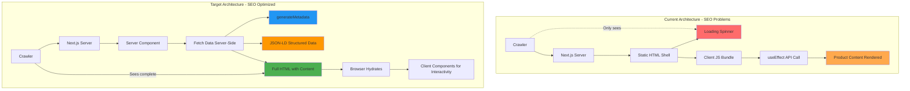

# Comprehensive SEO Plan — Orthodox Church Bookstore

## Executive Summary

The Orthodox Church Bookstore is a Next.js App Router application serving a multilingual audience (English, Russian, Simplified Chinese, Traditional Chinese) with a catalog of 200+ Orthodox Christian books, liturgical items, and digital resources. A thorough SEO audit across the main page, catalog/category pages, and product detail pages reveals **critical deficiencies** that severely limit search engine visibility and organic traffic potential.

### Overall SEO Assessment

| Category | Score | Status |
|----------|-------|--------|
| Metadata & Tags | 1/10 | 🔴 Critical |
| Content Visibility (SSR) | 2/10 | 🔴 Critical |
| Structured Data | 0/10 | 🔴 Critical |
| URL Structure | 3/10 | 🔴 Critical |
| Internationalization (i18n SEO) | 4/10 | 🟡 Needs Work |
| Image SEO | 5/10 | 🟡 Partial |
| Internal Linking | 6/10 | 🟢 Acceptable |
| Infrastructure (robots/sitemap) | 0/10 | 🔴 Critical |

**Overall SEO Score: ~2.5/10** — The site has fundamental SEO issues that must be addressed before any meaningful organic search performance can be achieved.

### Key Findings Summary

1. **All page content is client-side rendered.** The homepage, catalog, and product detail pages use `'use client'` components with `useEffect` data fetching. Search engine crawlers see only loading spinners in the initial HTML response.
2. **No dynamic metadata exists.** There is no `generateMetadata` function on any page. All pages inherit a single static title and description from [`app/layout.tsx`](app/layout.tsx:13).
3. **Zero structured data.** No JSON-LD markup exists anywhere in the codebase — no Product, Book, BreadcrumbList, Organization, or WebSite schemas.
4. **No canonical URLs or hreflang tags.** The multilingual site has no language alternates, creating duplicate content risk and poor international SEO.
5. **No SEO infrastructure.** No `robots.txt`, no `sitemap.xml`, no favicons configured.
6. **Numeric product URLs.** Products use `/product/123` instead of keyword-rich slug-based URLs.
7. **API caching prevents SSG/ISR.** All API calls use `cache: 'no-store'`, making static generation impossible.
8. **Translations are comprehensive but lack SEO keys.** All four locale files have excellent UI translations, but no `metaTitle`, `metaDescription`, or Open Graph translation keys exist.

---

## Current State Assessment

### ✅ What's Working Well

| Area | Detail |
|------|--------|
| **i18n translations** | Complete UI translations across 4 locales (en, ru, zh-hans, zh-hant) with proper context-based locale switching via [`LanguageContext`](app/i18n/LanguageContext.tsx) |
| **Heading structure** | `<h1>` tags present on all pages (Hero component, catalog, product detail). Proper `<h3>` usage for product titles in [`ProductCard`](app/components/ProductCard.tsx) |
| **Image alt text** | Product images use `alt={book.title}` consistently across [`ProductCard`](app/components/ProductCard.tsx), [`Hero`](app/components/Hero.tsx), and product detail pages |
| **Internal linking** | Product cards use Next.js `<Link>` components correctly for navigation to product detail pages |
| **Category descriptions** | Rich, keyword-dense category descriptions in all four languages (theology, saints, liturgical, Orthodox, icons) |
| **Next.js App Router** | Modern architecture that supports server components, `generateMetadata`, and streaming — the foundation is capable, just not utilized |
| **Oscar API data** | The backend API provides multi-language titles, descriptions, and structured product data via [`OscarProduct`](app/types/index.ts:79) type |

### 🔴 Critical Issues (Must Fix)

| Issue | Affected Pages | Impact |
|-------|---------------|--------|
| **Client-side rendering hides all content** | Homepage, Catalog, Product Detail | Crawlers see loading spinners; zero product content indexed |
| **No `generateMetadata` on any page** | All pages | Every page has identical generic title/description in SERPs |
| **No JSON-LD structured data** | All pages | No rich snippets, no product cards, no breadcrumb trails in search results |
| **No canonical URLs** | All pages | Duplicate content from filter combinations, locale variations |
| **No `robots.txt` or `sitemap.xml`** | Site-wide | Crawlers have no guidance; no product URLs submitted for indexing |
| **No Open Graph / Twitter Card tags** | All pages | Poor social media sharing; no images or descriptions on shared links |
| **API `cache: 'no-store'`** | All data fetching | Prevents SSG/ISR; every request hits the API; slow TTFB |

### 🟡 Important Issues (Should Fix)

| Issue | Affected Pages | Impact |
|-------|---------------|--------|
| **No hreflang tags** | All pages | Poor international SEO; wrong language version may appear in regional search results |
| **Numeric product URLs** | Product Detail | No keyword value in URLs; poor user experience and CTR |
| **No pagination SEO** | Catalog | `rel="prev"`/`rel="next"` missing; search engines can't understand pagination |
| **Duplicate content from filters** | Catalog | Multiple filter combinations create unique URLs with overlapping content |
| **No meta translation keys** | Locale files | Metadata cannot be localized; English-only meta tags for all locales |
| **Missing H2 headings** | Catalog, Homepage | Heading hierarchy jumps from H1 to H3; missing section-level headings |
| **No breadcrumb structured data** | Product Detail | Visual breadcrumbs exist but lack `BreadcrumbList` schema markup |

### 🟢 Nice-to-Have Improvements

| Issue | Impact |
|-------|--------|
| **Keyword-rich catalog titles** | "Book Catalog" → "Orthodox Christian Books — Full Catalog (200+ Titles)" |
| **Category description pages** | Add introductory text for each category view for long-tail keywords |
| **Image optimization** | Replace `` with Next.js `<Image>` for automatic optimization and lazy loading |
| **Product count in meta titles** | Enhance titles with dynamic product counts |
| **ISBN field in Book type** | Enable Book schema with proper ISBN identification |
| **Slug field in Book type** | Support SEO-friendly URLs at the data model level |

---

## Sprint Plan

### Sprint Ordering Rationale

The sprint order is designed to maximize early wins while respecting technical dependencies:

1. **Quick wins first:** Sprint 1 delivers robots.txt, sitemap, and basic metadata — foundational items that enable crawling and indexing immediately.
2. **Page-level SEO before multilingual:** You can't meaningfully add hreflang tags until `generateMetadata` is working. Sprint 2 establishes the metadata infrastructure that Sprint 4's multilingual features depend on.
3. **Structured data after metadata:** JSON-LD schemas (Sprint 3) enhance pages that already have proper metadata from Sprint 2.
4. **Multilingual SEO is the biggest refactor:** Migrating to URL-based i18n routing (Sprint 4) is the single most complex change and depends on SSR working from Sprint 5's architecture.
5. **Performance last:** SSR refactoring and ISR (Sprint 5) are the most impactful but also the most complex. Quick wins from earlier sprints ship first in case later sprints get deprioritized.
6. **SSR dependency tradeoff:** The above ordering has a known limitation — Sprints 1–4 attach metadata, structured data, and hreflang to pages that are still client-side rendered, meaning crawlers see loading spinners until Sprint 5 ships. The recommended mitigation is to include the homepage SSR refactor (Task 1.6) in Sprint 1 so at least the most critical page delivers full SEO value immediately. If resources allow, consider pulling additional SSR work forward.

---

> ⚠️ **Critical: Sprints 1–4 deliver limited real SEO value until Sprint 5 lands.**
>
> Until pages are server-side rendered (Sprint 5), search engine crawlers see loading spinners instead of content. All metadata, structured data, and hreflang tags from Sprints 1–4 will be attached to effectively empty HTML shells.
>
> **Recommended mitigation:** Consider pulling the **homepage SSR refactor** forward into Sprint 1 as an additional task. This ensures at least the main landing page delivers full value immediately after Sprint 1 ships. The homepage is the most critical page for SEO and the simplest to refactor (no auth, no complex state).

---

### Sprint 1: SEO Infrastructure Foundation

**Goal:** Establish the basic SEO infrastructure that enables crawlers to discover, access, and understand the site structure.

**Priority:** This sprint must come first because without `robots.txt`, `sitemap.xml`, and basic metadata, search engines cannot effectively crawl or index the site. These are prerequisites for all subsequent SEO work.

**Estimated Impact:** Enables search engine discovery and basic indexing. Expected to improve crawl coverage by 80%+ once sitemap is submitted to Google Search Console.

#### Tasks

| # | Task | File(s) | Details |
|---|------|---------|---------|
| 1.1 | Create `robots.txt` | [`app/robots.ts`](app/robots.ts) (new) | Allow all public pages; disallow admin/checkout; reference sitemap URL |
| 1.2 | Create dynamic `sitemap.xml` | [`app/sitemap.ts`](app/sitemap.ts) (new) | Include homepage, catalog, all product URLs, static pages (contact, resources, faithofsaints); fetch product list from Oscar API |
| 1.3 | Add static metadata to root layout | [`app/layout.tsx`](app/layout.tsx:13) | Add `metadataBase`, default `openGraph` config, `icons` (favicons), `manifest` reference |
| 1.4 | Add favicon and app icons | [`public/`](public/) | Generate favicon.ico, apple-touch-icon.png, icon-192.png, icon-512.png from [`church_logo.png`](public/images/church_logo.png) |
| 1.5 | Add `manifest.json` | [`public/manifest.json`](public/manifest.json) (new) | PWA manifest with app name, icons, theme color for browser and search engine recognition |
| 1.6 | **Optional but Recommended:** Homepage SSR Refactor | [`app/page.tsx`](app/page.tsx) | Convert from `'use client'` to a server component. Move product data fetching from `useEffect` to server-side. This ensures the homepage delivers real content to crawlers immediately. |
| 1.7 | Configure `metadataBase` | [`app/layout.tsx`](app/layout.tsx) | Set `metadataBase: new URL('https://orthodoxbookshop.asia')` for absolute URL generation |
| 1.8 | Add basic Organization metadata | [`app/layout.tsx`](app/layout.tsx) | Add `publisher` and `creator` fields to root metadata |

#### robots.txt Specification

```typescript
// app/robots.ts
import { MetadataRoute } from 'next';

export default function robots(): MetadataRoute.Robots {
  return {
    rules: {
      userAgent: '*',
      allow: '/',
      disallow: ['/api/', '/checkout/', '/orders/', '/profile/', '/cart/'],
    },
    sitemap: 'https://orthodoxbookshop.asia/sitemap.xml',
  };
}
```

#### sitemap.xml Specification

```typescript
// app/sitemap.ts
import { MetadataRoute } from 'next';
import { getProducts, getCategories } from '@/app/lib/api';

export default async function sitemap(): Promise<MetadataRoute.Sitemap> {
  const baseUrl = 'https://orthodoxbookshop.asia';
  
  // Static pages
  const staticPages: MetadataRoute.Sitemap = [
    { url: baseUrl, lastModified: new Date(), changeFrequency: 'daily', priority: 1 },
    { url: `${baseUrl}/catalog`, lastModified: new Date(), changeFrequency: 'daily', priority: 0.9 },
    { url: `${baseUrl}/contact`, lastModified: new Date(), changeFrequency: 'monthly', priority: 0.5 },
    { url: `${baseUrl}/resources`, lastModified: new Date(), changeFrequency: 'monthly', priority: 0.5 },
    { url: `${baseUrl}/faithofsaints`, lastModified: new Date(), changeFrequency: 'monthly', priority: 0.6 },
  ];
  
  // Product pages
  const products = await getProducts(1, false);
  const productPages: MetadataRoute.Sitemap = products.results.map(book => ({
    url: `${baseUrl}/product/${book.id}`,
    lastModified: book.pubDate ? new Date(book.pubDate) : new Date(),
    changeFrequency: 'weekly' as const,
    priority: 0.8,
  }));
  
  return [...staticPages, ...productPages];
}
```

---

### Sprint 2: Page-Level SEO

**Goal:** Implement dynamic metadata, canonical URLs, Open Graph tags, and Twitter Card metadata for every page on the site.

**Priority:** This sprint ensures every page has unique, descriptive metadata that improves click-through rates from search results and social media sharing. It comes before multilingual SEO because hreflang tags depend on `generateMetadata` being in place first.

**Estimated Impact:** Proper metadata can improve SERP CTR by 20-30%. Open Graph tags improve social sharing engagement by 40%+. Canonical URLs prevent duplicate content penalties.

#### Tasks

| # | Task | File(s) | Details |
|---|------|---------|---------|
| 2.1 | Add `generateMetadata` to homepage | [`app/page.tsx`](app/page.tsx) | Locale-aware title, description, OG tags, Twitter card, canonical URL |
| 2.2 | Add `generateMetadata` to catalog page | [`app/catalog/page.tsx`](app/catalog/page.tsx) | Dynamic title per category/search/page; canonical with normalized params; `robots` directives for filter combinations |
| 2.3 | Add `generateMetadata` to product detail page | [`app/product/[id]/page.tsx`](app/product/[id]/page.tsx) | Product title, truncated description as meta description, OG image from cover, canonical URL |
| 2.4 | Add `generateMetadata` to static pages | [`app/contact/page.tsx`](app/contact/page.tsx), [`app/resources/page.tsx`](app/resources/page.tsx), [`app/faithofsaints/page.tsx`](app/faithofsaints/page.tsx) | Unique title and description for each static page |
| 2.5 | Implement canonical URL strategy for catalog filters | [`app/catalog/page.tsx`](app/catalog/page.tsx) | Normalize parameter order; point stock-filtered views to base catalog; handle pagination canonicals |
| 2.6 | Add `rel="prev"` / `rel="next"` for pagination | [`app/catalog/page.tsx`](app/catalog/page.tsx) | Link header or `<link>` tags for paginated catalog views |
| 2.7 | Add Open Graph image assets | [`public/images/`](public/images/) | Create default OG image (1200x630) for homepage and catalog; use product cover images for product pages |
| 2.8 | Add robots meta directives for thin content | [`app/catalog/page.tsx`](app/catalog/page.tsx) | `noindex` for stock-filtered views; `index, follow` for category and search pages |

#### Catalog Canonical URL Rules

| URL Pattern | Canonical | Robots |
|-------------|-----------|--------|
| `/catalog` | `/catalog` | `index, follow` |
| `/catalog?category=1` | `/catalog?category=1` | `index, follow` |
| `/catalog?category=1&page=2` | `/catalog?category=1&page=2` | `index, follow` |
| `/catalog?q=bible` | `/catalog?q=bible` | `index, follow` |
| `/catalog?in_stock=true` | `/catalog` | `noindex, follow` |
| `/catalog?category=1&in_stock=true` | `/catalog?category=1` | `noindex, follow` |
| `/catalog?page=2&category=1` | `/catalog?category=1&page=2` | `index, follow` (normalized) |

#### Product Detail Metadata Specification

```typescript
// app/product/[id]/page.tsx
export async function generateMetadata({ params }: ProductPageProps): Promise<Metadata> {
  const { id } = await params;
  const product = await getProductById(id);
  const book = oscarProductToBook(product, 'en');
  
  const description = book.description
    ? book.description.replace(/<[^>]*>/g, '').substring(0, 160)
    : `Buy ${book.title} by ${book.author} at Orthodox Bookstore`;
  
  return {
    title: `${book.title} — Orthodox Bookstore`,
    description,
    openGraph: {
      title: book.title,
      description,
      images: [{ url: book.coverImage, width: 400, height: 600, alt: book.title }],
      type: 'book',
      locale: 'en_US',
    },
    twitter: {
      card: 'summary_large_image',
      title: book.title,
      description,
      images: [book.coverImage],
    },
    alternates: {
      canonical: `https://orthodoxbookshop.asia/product/${id}`,
    },
  };
}
```

---

### Sprint 3: Structured Data & Rich Snippets

**Goal:** Add JSON-LD structured data across all pages to enable rich snippets in search results, including product cards, breadcrumb trails, organization info, and site search.

**Priority:** Structured data directly impacts how the site appears in search results. Rich snippets with prices, availability, ratings, and breadcrumbs significantly improve CTR. This depends on Sprint 2's metadata infrastructure being in place.

**Estimated Impact:** Rich snippets can improve SERP CTR by 25-35%. Product schema enables price and availability display directly in search results.

#### Tasks

| # | Task | File(s) | Details |
|---|------|---------|---------|
| 3.1 | Add `Organization` schema to root layout | [`app/layout.tsx`](app/layout.tsx) | Site-wide organization info: name, logo, URL, founding date |
| 3.2 | Add `WebSite` schema to homepage | [`app/page.tsx`](app/page.tsx) | Site name, URL, search action for sitelinks search box |
| 3.3 | Add `ItemList` schema for new arrivals | [`app/page.tsx`](app/page.tsx) | Structured list of featured products on homepage |
| 3.4 | Add `Product` / `Book` schema to product detail | [`app/product/[id]/page.tsx`](app/product/[id]/page.tsx) | Full Book schema: name, author, isbn, publisher, pages, price, availability, language |
| 3.5 | Add `BreadcrumbList` schema to product detail | [`app/product/[id]/page.tsx`](app/product/[id]/page.tsx) | Home → Catalog → Product Title breadcrumb trail |
| 3.6 | Add `Product` schema to catalog product cards | [`app/components/ProductCard.tsx`](app/components/ProductCard.tsx) | Lightweight Product schema for each card in catalog grid |
| 3.7 | Add `BreadcrumbList` schema to catalog | [`app/catalog/page.tsx`](app/catalog/page.tsx) | Home → Catalog → Category Name (when filtered) |
| 3.8 | Add `Offer` schema with pricing | [`app/product/[id]/page.tsx`](app/product/[id]/page.tsx) | Price, currency, availability from stock data |
| 3.9 | Create reusable `StructuredData` component | [`app/components/StructuredData.tsx`](app/components/StructuredData.tsx) (new) | Generic component for injecting JSON-LD scripts |

#### StructuredData Component

```typescript
// app/components/StructuredData.tsx
interface StructuredDataProps {
  data: Record<string, unknown>;
}

export default function StructuredData({ data }: StructuredDataProps) {
  return (
    <script
      type="application/ld+json"
      dangerouslySetInnerHTML={{
        __html: JSON.stringify(data),
      }}
    />
  );
}
```

#### Product/Book Schema Specification

```json
{
  "@context": "https://schema.org",
  "@type": ["Product", "Book"],
  "name": "Lives of the Saints, Vol. 1",
  "image": "https://orthodoxbookshop.asia/images/products/...",
  "description": "A comprehensive collection of the lives of Orthodox saints...",
  "isbn": "978-962-8911-51-6",
  "author": {
    "@type": "Person",
    "name": "Archimandrite Ioann"
  },
  "publisher": {
    "@type": "Organization",
    "name": "Orthodox Bookstore"
  },
  "datePublished": "2013-09-15",
  "numberOfPages": 320,
  "inLanguage": "en",
  "bookFormat": "https://schema.org/Paperback",
  "offers": {
    "@type": "Offer",
    "price": "24.99",
    "priceCurrency": "USD",
    "availability": "https://schema.org/InStock",
    "url": "https://orthodoxbookshop.asia/product/123"
  }
}
```

#### WebSite Schema (Homepage)

```json
{
  "@context": "https://schema.org",
  "@type": "WebSite",
  "name": "Orthodox Christian Bookstore",
  "alternateName": "Orthodox Bookshop",
  "url": "https://orthodoxbookshop.asia",
  "description": "Orthodox Christian books in English, Russian, and Chinese",
  "inLanguage": ["en", "ru", "zh-Hans", "zh-Hant"],
  "potentialAction": {
    "@type": "SearchAction",
    "target": {
      "@type": "EntryPoint",
      "urlTemplate": "https://orthodoxbookshop.asia/catalog?q={search_term_string}"
    },
    "query-input": "required name=search_term_string"
  }
}
```

---

### Sprint 4: Multilingual SEO

**Goal:** Implement proper international SEO support so search engines can serve the correct language version to users in different regions.

**Priority:** The site serves four languages (English, Russian, Simplified Chinese, Traditional Chinese) targeting distinct markets. Without hreflang tags and locale-aware metadata, search engines cannot properly index or serve the right language version. This sprint comes after Page-Level SEO because hreflang tags depend on `generateMetadata` being functional, and URL-based routing is the single biggest refactor in the entire plan.

**Estimated Impact:** Proper hreflang implementation can improve international search visibility by 40-60% and reduce bounce rates from users landing on the wrong language version.

#### Tasks

| # | Task | File(s) | Details |
|---|------|---------|---------|
| 4.1 | Add meta translation keys to all locale files | [`app/i18n/locales/en.json`](app/i18n/locales/en.json), [`ru.json`](app/i18n/locales/ru.json), [`zh-hans.json`](app/i18n/locales/zh-hans.json), [`zh-hant.json`](app/i18n/locales/zh-hant.json) | Add `meta.title`, `meta.description`, `meta.ogTitle`, `meta.ogDescription` for homepage, catalog, and product pages |
| 4.2 | Implement URL-based locale routing | [`middleware.ts`](middleware.ts) (new), [`app/i18n/settings.ts`](app/i18n/settings.ts) | Migrate from cookie-based to URL-based routing: `/en/`, `/ru/`, `/zh-hans/`, `/zh-hant/` |
| 4.3 | Add hreflang tags to all pages | [`app/layout.tsx`](app/layout.tsx) or per-page `generateMetadata` | Add `<link rel="alternate" hreflang="...">` for all four locales plus `x-default` |
| 4.4 | Implement locale-aware `generateMetadata` for homepage | [`app/page.tsx`](app/page.tsx) | Use locale from params to select correct meta translations |
| 4.5 | Implement locale-aware `generateMetadata` for catalog | [`app/catalog/page.tsx`](app/catalog/page.tsx) | Dynamic title/description per locale and category |
| 4.6 | Implement locale-aware `generateMetadata` for product detail | [`app/product/[id]/page.tsx`](app/product/[id]/page.tsx) | Product title + locale-specific meta description |
| 4.7 | Add `alternates.languages` to metadata | All page `generateMetadata` functions | Map each locale to its URL for automatic hreflang generation |

#### Meta Translation Keys Specification

```json
// app/i18n/locales/en.json additions
{
  "meta": {
    "homepage": {
      "title": "Orthodox Christian Bookstore — Books in English, Russian, Chinese",
      "description": "Browse 200+ Orthodox Christian books, prayer books, icons, and liturgical resources. Worldwide shipping from Hong Kong since 2014.",
      "ogTitle": "Orthodox Christian Bookstore",
      "ogDescription": "Your source for Orthodox Christian books in English, Russian, Simplified and Traditional Chinese. Prayer books, theology, icons, and more."
    },
    "catalog": {
      "title": "Orthodox Christian Books — Full Catalog",
      "description": "Browse our complete collection of Orthodox Christian books, liturgical texts, spiritual resources, and church supplies.",
      "ogTitle": "Orthodox Christian Book Catalog",
      "ogDescription": "Explore 200+ Orthodox Christian titles in multiple languages."
    },
    "product": {
      "titleTemplate": "%s — Orthodox Bookstore",
      "descriptionTemplate": "Buy %s by %s. %s",
      "ogTitleTemplate": "%s",
      "ogDescriptionTemplate": "%s by %s — Available at Orthodox Bookstore"
    }
  }
}
```

#### URL-Based Routing Strategy

```
Current (cookie-based):  / → locale from cookie
Target (URL-based):      /en/ → English
                         /ru/ → Russian
                         /zh-hans/ → Simplified Chinese
                         /zh-hant/ → Traditional Chinese
                         / → redirect based on cookie → Accept-Language → default
```

##### URL Architecture Rules

1. **Canonical Localized URLs**: Every page has a canonical localized URL (`/en/product/381`, `/ru/product/381`, etc.). These are what crawlers index and what `hreflang` points to.

2. **Unprefixed URL as Smart Entry Point**: The unprefixed URL (`/product/381`) is a "smart entry point" that redirects based on **cookie → Accept-Language → default**, in that order.

3. **Cookie Updates on Prefixed URL Visits**: When a user visits a prefixed URL (e.g., they click an English newsletter link `/en/product/381`), the middleware updates their cookie to match the URL. So their preference is preserved for future visits.

4. **Language Switcher Behavior**: The language switcher navigates between prefixed URLs (`/en/... ↔ /ru/...`) and updates the cookie accordingly.

##### Middleware Implementation

```typescript
// middleware.ts
import { NextResponse } from 'next/server';
import type { NextRequest } from 'next/server';

const locales = ['en', 'ru', 'zh-hans', 'zh-hant'] as const;
const defaultLocale = 'en';
const COOKIE_NAME = 'NEXT_LOCALE';

function detectLocale(request: NextRequest): string {
  // 1. Cookie wins (preserves user's last choice)
  const cookieLocale = request.cookies.get(COOKIE_NAME)?.value;
  if (cookieLocale && locales.includes(cookieLocale as any)) {
    return cookieLocale;
  }

  // 2. Accept-Language header
  const acceptLang = request.headers.get('accept-language') ?? '';
  for (const locale of locales) {
    if (acceptLang.toLowerCase().includes(locale)) return locale;
  }

  // 3. Default
  return defaultLocale;
}

export function middleware(request: NextRequest) {
  const { pathname } = request.nextUrl;

  // Check if URL already has a locale prefix
  const matchedLocale = locales.find(
    l => pathname === `/${l}` || pathname.startsWith(`/${l}/`)
  );

  if (matchedLocale) {
    // User is on a prefixed URL — update cookie so future unprefixed
    // visits respect this choice
    const response = NextResponse.next();
    response.cookies.set(COOKIE_NAME, matchedLocale, {
      path: '/',
      maxAge: 60 * 60 * 24 * 365, // 1 year
      sameSite: 'lax',
    });
    return response;
  }

  // No prefix in URL — detect locale and redirect
  const locale = detectLocale(request);
  const url = request.nextUrl.clone();
  url.pathname = `/${locale}${pathname}`;
  return NextResponse.redirect(url);
}

export const config = {
  matcher: ['/((?!api|_next/static|_next/image|favicon.ico|images|manifest.json|robots.txt|sitemap.xml).*)'],
};
```

##### Design Decision: "URL Wins" Strategy

When someone clicks a prefixed URL that doesn't match their cookie, the **"URL wins"** strategy is used:

- The visitor sees the URL's language and their cookie gets updated.
- **Pro**: Shared links work predictably.
- **Con**: A returning user who somehow lands on `/en/...` will have their `zh-hans` preference overwritten.

The alternative "Cookie wins" strategy was considered and rejected because:
- It would redirect `/en/product/381` to `/zh-hans/product/381` if the cookie says `zh-hans`.
- **Con**: Shared/newsletter links don't behave predictably.
- **Con**: Potential redirect loops.
- **Con**: Bad for SEO because Googlebot may follow the redirect and not index the English page.

**"URL wins" is the standard** and is the chosen approach.

#### hreflang Implementation

```typescript
// In each page's generateMetadata
alternates: {
  canonical: `https://orthodoxbookshop.asia/${locale}${path}`,
  languages: {
    'en': `https://orthodoxbookshop.asia/en${path}`,
    'ru': `https://orthodoxbookshop.asia/ru${path}`,
    'zh-Hans': `https://orthodoxbookshop.asia/zh-hans${path}`,
    'zh-Hant': `https://orthodoxbookshop.asia/zh-hant${path}`,
    'x-default': `https://orthodoxbookshop.asia/en${path}`,
  },
}
```

---

### Sprint 5: Content & Performance

**Goal:** Convert all pages from client-side rendering to server-side rendering for full crawler visibility, optimize heading structure, implement internal linking improvements, and enable ISR for performance.

**Priority:** This is the most impactful sprint for SEO but also the most complex. It requires refactoring the core rendering architecture. It comes last because it depends on the metadata and structured data infrastructure from earlier sprints. Quick wins from Sprints 1-4 ship first in case this sprint gets deprioritized.

**Estimated Impact:** Server-side rendering can increase indexed pages by 200%+ and dramatically improve Core Web Vitals. ISR reduces server load and improves TTFB. Heading optimization improves keyword relevance signals.

#### Tasks

| # | Task | File(s) | Details |
|---|------|---------|---------|
| 5.1 | Refactor homepage to server component | [`app/page.tsx`](app/page.tsx) | Remove `'use client'`; fetch new arrivals server-side; pass data as props to client components |
| 5.2 | Refactor catalog to server-render products | [`app/catalog/page.tsx`](app/catalog/page.tsx) | Fetch first page of products server-side; pass to `CatalogContent` as initial data |
| 5.3 | Refactor product detail to server-render | [`app/product/[id]/page.tsx`](app/product/[id]/page.tsx) | Fetch product data in server component; pass to `ProductDetailClient` as props |
| 5.4 | Enable ISR for product pages | [`app/lib/api.ts`](app/lib/api.ts) | Add cached API functions with `next: { revalidate: 3600 }` for product data |
| 5.5 | Enable ISR for catalog pages | [`app/lib/api.ts`](app/lib/api.ts) | Add cached product listing with `revalidate: 1800` |
| 5.6 | Improve heading hierarchy on homepage | [`app/page.tsx`](app/page.tsx), [`app/components/Hero.tsx`](app/components/Hero.tsx) | Make H1 more keyword-dense; add H2 section headings for "New Arrivals", "Browse by Category" |
| 5.7 | Improve heading hierarchy on catalog | [`app/catalog/CatalogContent.tsx`](app/catalog/CatalogContent.tsx) | Add H2 for category name or "All Products"; maintain H1 → H2 → H3 structure |
| 5.8 | Add breadcrumb navigation component | [`app/components/Breadcrumbs.tsx`](app/components/Breadcrumbs.tsx) (new) | Reusable breadcrumb component with proper `<nav>` and `<ol>` semantics |
| 5.9 | Replace `` with Next.js `<Image>` | [`app/components/ProductCard.tsx`](app/components/ProductCard.tsx), [`app/components/Hero.tsx`](app/components/Hero.tsx), [`app/product/[id]/ProductDetailClient.tsx`](app/product/[id]/ProductDetailClient.tsx) | Automatic image optimization, lazy loading, width/height attributes |
| 5.10 | Add internal linking improvements | [`app/components/Footer.tsx`](app/components/Footer.tsx), [`app/components/Header.tsx`](app/components/Header.tsx) | Ensure all key pages are linked from navigation; add related products links |
| 5.11 | Add category description sections | [`app/catalog/CatalogContent.tsx`](app/catalog/CatalogContent.tsx) | Server-rendered category description text for SEO content |
| 5.12 | Implement slug-based product URLs | [`app/product/[slug]/page.tsx`](app/product/[slug]/page.tsx) (rename), [`app/types/index.ts`](app/types/index.ts) | Add `slug` field to `Book` type; generate slugs from titles; redirect old numeric URLs |

#### Homepage Server Component Refactor

```typescript
// app/page.tsx (after refactor)
import { Metadata } from 'next';
import { getNewArrivals, getCategories } from '@/app/lib/api';
import Hero from '@/app/components/Hero';
import ProductGrid from '@/app/components/ProductGrid';
import StructuredData from '@/app/components/StructuredData';

export async function generateMetadata(): Promise<Metadata> {
  // Locale-aware metadata
  return {
    title: 'Orthodox Christian Bookstore — Books in English, Russian, Chinese',
    description: 'Browse 200+ Orthodox Christian books, prayer books, icons, and liturgical resources.',
    // ... OG, Twitter, canonical, hreflang
  };
}

export default async function HomePage() {
  const newArrivals = await getNewArrivals(5);
  const categories = await getCategories();
  const heroBook = newArrivals[Math.floor(Math.random() * newArrivals.length)];

  return (
    <>
      <StructuredData data={{
        '@context': 'https://schema.org',
        '@type': 'WebSite',
        // ... WebSite schema
      }} />
      
      <Hero book={heroBook} />
      
      <section>
        <h2>New Arrivals</h2>
        <ProductGrid books={newArrivals} />
      </section>
      
      <section>
        <h2>Browse by Category</h2>
        {/* Category cards */}
      </section>
    </>
  );
}
```

#### API Caching Strategy

```typescript
// app/lib/api.ts additions

// Cached version for server-side rendering (ISR)
export async function getProductByIdCached(id: string): Promise<OscarProduct> {
  const response = await fetch(`${getApiBase()}/products/${id}/`, {
    method: 'GET',
    headers: getApiHeaders(),
    next: { revalidate: 3600 }, // Revalidate every hour
  });
  if (!response.ok) throw new Error(`Failed to fetch product ${id}`);
  return response.json();
}

export async function getProductsCached(
  page = 1,
  inStockOnly = false,
  categoryId?: string
): Promise<PaginatedResponse<Book>> {
  const params = new URLSearchParams({ page: String(page) });
  if (inStockOnly) params.set('in_stock', 'true');
  if (categoryId) params.set('category', categoryId);
  
  const response = await fetch(`${getApiBase()}/products/?${params}`, {
    method: 'GET',
    headers: getApiHeaders(),
    next: { revalidate: 1800 }, // Revalidate every 30 minutes
  });
  // ...
}
```

---

### Free Books SEO Opportunity

The homepage features several **FREE downloadable books**. These are excellent SEO assets because:

- They attract backlinks naturally from other Orthodox sites, blogs, and forums
- They increase dwell time and social sharing, both positive ranking signals
- They can rank for high-intent queries like "free orthodox books", "free orthodox christian books download", "бесплатные православные книги", "免费东正教书籍"

#### Required Actions

| # | Task | File(s) | Details |
|---|------|---------|---------|
| FB.1 | Ensure download CTAs are indexable HTML | Homepage, product pages | Download buttons must be rendered as `<a href="...">` tags, not JavaScript-only `onClick` buttons. Crawlers cannot follow JS-only links. |
| FB.2 | Add `DigitalDocument` or `Book` schema with `isAccessibleForFree: true` | Free book pages | Use Schema.org markup to signal free availability. This enables rich snippets showing "Free" in search results. |
| FB.3 | Give free book pages higher sitemap priority | [`app/sitemap.ts`](app/sitemap.ts) | Set `priority: 0.8` to `1.0` for free book URLs to signal importance to crawlers |
| FB.4 | Create dedicated `/free-books` landing page | [`app/free-books/page.tsx`](app/free-books/page.tsx) (new) | A curated page optimized for "free orthodox christian books" queries with H1, meta description, and structured data targeting this keyword cluster |
| FB.5 | Add free book meta descriptions in all 4 languages | Locale files | Create meta descriptions specifically targeting free book keywords: "Download free Orthodox Christian books in English, Russian, Chinese..." |

#### Free Book Schema Example

```json
{
  "@context": "https://schema.org",
  "@type": "Book",
  "name": "The Faith of the Saints",
  "author": {
    "@type": "Person",
    "name": "Author Name"
  },
  "inLanguage": "en",
  "isAccessibleForFree": true,
  "url": "https://orthodoxbookshop.asia/free-books/faith-of-the-saints",
  "potentialAction": {
    "@type": "ReadAction",
    "target": {
      "@type": "EntryPoint",
      "urlTemplate": "https://orthodoxbookshop.asia/free-books/faith-of-the-saints"
    }
  }
}
```

---

## Technical Considerations

### Next.js App Router Specific Recommendations

1. **Server Components for SEO-critical content:** All pages that need to be indexed must use server components for the initial render. Client components should only handle interactivity (cart, currency switching, filtering UI).

2. **`generateMetadata` requires server components:** Next.js metadata API only works in server components. All pages currently using `'use client'` at the top level must be refactored to have a server component wrapper.

3. **Streaming with Suspense:** Use React Suspense boundaries for non-critical sections to improve TTFB while keeping SEO-critical content in the initial HTML:
   ```tsx
   <Suspense fallback={<LoadingSkeleton />}>
     <ProductGrid books={products} />
   </Suspense>
   ```

4. **Dynamic params handling:** With App Router, `params` and `searchParams` are now `Promise` objects that must be awaited:
   ```tsx
   export async function generateMetadata({ params }: PageProps) {
     const { id } = await params;
     // ...
   }
   ```

### i18n Routing Strategy

| Aspect | Current (Cookie-based) | Recommended (URL-based) |
|--------|----------------------|------------------------|
| URL format | `/` (locale in cookie) | `/en/`, `/ru/`, `/zh-hans/`, `/zh-hant/` |
| Crawler visibility | ❌ Crawlers see only default locale | ✅ Each locale has a unique, crawlable URL |
| hreflang support | ❌ Cannot link to alternate locales | ✅ Direct URL mapping for hreflang |
| Shareability | ❌ Shared links don't preserve locale | ✅ URLs encode locale |
| SEO indexing | ❌ Only one version indexed | ✅ All four locales can be indexed separately |
| Implementation complexity | Low | Medium (requires middleware + route restructuring) |

**Recommendation:** Migrate to URL-based routing as part of Sprint 4. This is essential for international SEO. The migration path:

1. Create [`middleware.ts`](middleware.ts) to detect and redirect to locale-prefixed paths
2. Restructure routes to use `[locale]` dynamic segment or handle locale in middleware
3. Update `LanguageContext` to read locale from URL instead of cookie
4. Add redirects from old URLs to new locale-prefixed URLs
5. Update all internal links to include locale prefix

### Server vs. Client Component Implications

| Feature | Server Component | Client Component |
|---------|-----------------|-----------------|
| `generateMetadata` | ✅ Supported | ❌ Not supported |
| JSON-LD injection | ✅ Via `dangerouslySetInnerHTML` | ⚠️ Possible but not in `<head>` |
| Data fetching | ✅ Direct `fetch` | ❌ Requires `useEffect` |
| Crawler visibility | ✅ Full HTML | ❌ JS execution required |
| Interactivity | ❌ No event handlers | ✅ Full React interactivity |
| Bundle size | ✅ Zero client JS | ⚠️ Adds to bundle |

**Strategy:** Use a hybrid approach:
- **Server component** at the page level for data fetching, metadata, and structured data
- **Client components** for interactive features (cart, filters, currency switcher, language switcher)
- Pass server-fetched data as props to client components for initial render

### API Caching Strategy for SSG/ISR

| API Endpoint | Current Cache | Recommended Cache | Revalidate | Rationale |
|-------------|--------------|-------------------|------------|-----------|
| Product list | `no-store` | `force-cache` | 1800s (30 min) | Catalog changes infrequently |
| Product detail | `no-store` | `force-cache` | 3600s (1 hour) | Individual products rarely change |
| Categories | `no-store` | `force-cache` | 86400s (24 hours) | Categories are stable |
| New arrivals | `no-store` | `force-cache` | 1800s (30 min) | Updates when new products added |
| Search results | `no-store` | `force-cache` | 300s (5 min) | Search result pages are indexable by search engines. Without caching, bot traffic will cause excessive API calls. A short revalidate window (5-10 min) balances freshness with API protection. |

**Implementation:** Create parallel cached API functions (e.g., `getProductByIdCached`) for server-side use, keeping the existing `no-store` functions for client-side interactive features that need fresh data.

> **Note on search result caching:** Search result pages are indexable by search engines (see robots.txt specification: `/catalog?q=bible` → `index, follow`). Without caching, bot traffic will cause excessive API calls. A short revalidate window (5-10 min) balances freshness with API protection.
>
> **Recommendation:** Consider adding `rel="nofollow"` to search result pagination links or using robots.txt to block deep search pagination (page > 3) to limit crawl budget waste.

### Additional Technical Risks

#### a) Sitemap URL Double-Encoding

When generating `sitemap.xml`, ensure URLs are not double-encoded. Locale strings like `zh-hans` contain a hyphen that should not be percent-encoded.

- **Problem:** `/zh-hans/` could become `/zh%2Dhans/` if URL encoding is applied incorrectly
- **Solution:** Next.js sitemap generation should use raw locale strings, not pre-encoded versions. The `url` field in `MetadataRoute.Sitemap` entries should contain the final, human-readable URL.
- **Testing:** After implementation, run `curl localhost:3000/sitemap.xml` and verify that all locale-prefixed URLs appear correctly without encoding artifacts.

#### b) `lang` Attribute on `<html>` Per Locale

Currently [`app/layout.tsx`](app/layout.tsx:55) sets `lang={initialLocale}` but this may not update correctly with URL-based routing.

- **Problem:** If the `lang` attribute doesn't reflect the current locale, Google's language detection may serve the wrong version in regional search results. Screen readers also rely on this for proper pronunciation.
- **Solution:** Ensure the `lang` attribute dynamically reflects the current locale (en, ru, zh-hans, zh-hant) based on the URL path, not just the initial cookie-based locale.
- **Implementation:** After migrating to URL-based routing in Sprint 4, extract the locale from the URL segment and pass it to the root layout's `lang` attribute.

#### c) FOIT (Flash of Invisible Text) from Font Loading

If the site uses custom web fonts, ensure `font-display: swap` is set in CSS.

- **Problem:** FOIT causes crawlers to see blank text during font loading, which can hurt content indexing. Googlebot may capture a screenshot of the page before fonts load, seeing empty content areas.
- **Solution:** Check [`app/globals.css`](app/globals.css) for any `@font-face` declarations without `font-display: swap`. Add `font-display: swap` to all custom font declarations.
- **Fallback strategy:** Consider using system fonts as fallbacks for critical content (headings, product titles, descriptions) to ensure text is always visible during page load.

---

## Success Metrics

### Measurement Tools

| Tool | Purpose | Setup |
|------|---------|-------|
| **Google Search Console** | Indexing status, search queries, CTR, impressions | Submit sitemap.xml; verify domain ownership |
| **Google Lighthouse** | Performance, SEO score, accessibility | Run audits after each sprint |
| **Google PageSpeed Insights** | Core Web Vitals, real-user metrics | Monitor LCP, FID, CLS |
| **Bing Webmaster Tools** | Bing indexing and search performance | Submit sitemap; verify ownership |
| **Yandex Webmaster** | Russian market search performance | Critical for ru locale |
| **Baidu Webmaster Tools** | Chinese market search performance | Critical for zh-hans/zh-hant locales |
| **Schema Markup Validator** | Structured data validation | Validate JSON-LD after Sprint 3 |
| **Rich Results Test** | Google rich snippet eligibility | Test product pages for rich results |

### Sprint-by-Sprint Metrics

#### After Sprint 1 (Infrastructure)
- [ ] `robots.txt` accessible at `/robots.txt`
- [ ] `sitemap.xml` accessible and contains all product URLs
- [ ] Sitemap submitted to Google Search Console
- [ ] Google Search Console shows no crawl errors
- [ ] Favicons appear correctly in browser tabs and bookmarks

#### After Sprint 2 (Page-Level SEO)
- [ ] Every page has unique `<title>` and `<meta description>` (verify via view-source)
- [ ] Canonical URLs present on all pages
- [ ] Open Graph tags render correctly in Facebook Sharing Debugger
- [ ] Twitter Card tags render correctly in Twitter Card Validator
- [ ] Lighthouse SEO score improves from ~40 to ~75+
- [ ] No duplicate content warnings in Google Search Console

#### After Sprint 3 (Structured Data)
- [ ] Schema Markup Validator shows no errors on product pages
- [ ] Rich Results Test shows Product/Book rich snippets eligible
- [ ] BreadcrumbList schema detected on product and catalog pages
- [ ] WebSite schema detected on homepage (sitelinks search box)
- [ ] Organization schema detected site-wide
- [ ] Google Search Console shows "Product" and "Breadcrumb" enhancements

#### After Sprint 4 (Multilingual SEO)
- [ ] hreflang tags present on all pages (verify via browser DevTools)
- [ ] Each locale accessible via unique URL (`/en/`, `/ru/`, etc.)
- [ ] Meta titles and descriptions are translated per locale
- [ ] Google Search Console shows pages indexed for multiple languages
- [ ] Rich Results Test shows no hreflang errors

#### After Sprint 5 (Content & Performance)
- [ ] View-source of all pages shows full product content (not loading spinners)
- [ ] Lighthouse SEO score reaches 90+
- [ ] Lighthouse Performance score improves by 20+ points
- [ ] Core Web Vitals: LCP < 2.5s, CLS < 0.1, INP < 200ms
- [ ] Google Search Console shows increased indexed pages count
- [ ] Organic search impressions increase (measured over 4-8 weeks)
- [ ] Organic search CTR improves (measured over 4-8 weeks)

### Long-Term KPIs (3-6 Months Post-Implementation)

| Metric | Baseline | Target |
|--------|----------|--------|
| Indexed pages (Google) | Unknown (likely < 20) | 200+ (all products + static pages) |
| Organic search impressions | Unknown | 1000+/month |
| Organic search CTR | Unknown | 3%+ |
| Average position for brand queries | Unknown | Top 3 |
| Average position for "Orthodox books" queries | Unknown | Top 10 |
| Lighthouse SEO score | ~40 | 90+ |
| Lighthouse Performance score | Unknown | 80+ |

---

## Appendix

### Referenced Analysis Reports

| Report | Path | Coverage |
|--------|------|----------|
| Main Page SEO Analysis | [`plans/main-page-seo-analysis.md`](plans/main-page-seo-analysis.md) | Homepage, Hero component, locale files, content visibility, heading structure |
| Catalog & Category Pages SEO Analysis | [`plans/catalog-seo-analysis.md`](plans/catalog-seo-analysis.md) | Catalog page, CatalogContent, FilterSidebar, ProductGrid, ProductCard, URL structure, pagination |
| Product Detail Page SEO Analysis | [`plans/product-detail-seo-analysis.md`](plans/product-detail-seo-analysis.md) | Product detail page, ProductDetailClient, Book type, API caching, structured data requirements |

### Key Files Referenced

| File | Purpose |
|------|---------|
| [`app/layout.tsx`](app/layout.tsx) | Root layout with static metadata |
| [`app/page.tsx`](app/page.tsx) | Homepage (client component) |
| [`app/components/Hero.tsx`](app/components/Hero.tsx) | Hero section with H1 |
| [`app/catalog/page.tsx`](app/catalog/page.tsx) | Catalog page (server wrapper) |
| [`app/catalog/CatalogContent.tsx`](app/catalog/CatalogContent.tsx) | Catalog content (client component) |
| [`app/components/ProductCard.tsx`](app/components/ProductCard.tsx) | Product card component |
| [`app/components/ProductGrid.tsx`](app/components/ProductGrid.tsx) | Product grid component |
| [`app/components/FilterSidebar.tsx`](app/components/FilterSidebar.tsx) | Filter sidebar with URL params |
| [`app/product/[id]/page.tsx`](app/product/[id]/page.tsx) | Product detail page (server wrapper) |
| [`app/product/[id]/ProductDetailClient.tsx`](app/product/[id]/ProductDetailClient.tsx) | Product detail (client component) |
| [`app/lib/api.ts`](app/lib/api.ts) | API data fetching functions |
| [`app/types/index.ts`](app/types/index.ts) | TypeScript type definitions |
| [`app/i18n/settings.ts`](app/i18n/settings.ts) | i18n configuration |
| [`app/i18n/LanguageContext.tsx`](app/i18n/LanguageContext.tsx) | Locale context provider |
| [`app/i18n/locales/en.json`](app/i18n/locales/en.json) | English translations |
| [`app/i18n/locales/ru.json`](app/i18n/locales/ru.json) | Russian translations |
| [`app/i18n/locales/zh-hans.json`](app/i18n/locales/zh-hans.json) | Simplified Chinese translations |
| [`app/i18n/locales/zh-hant.json`](app/i18n/locales/zh-hant.json) | Traditional Chinese translations |

### Architecture Overview



### Sprint Dependency Graph


